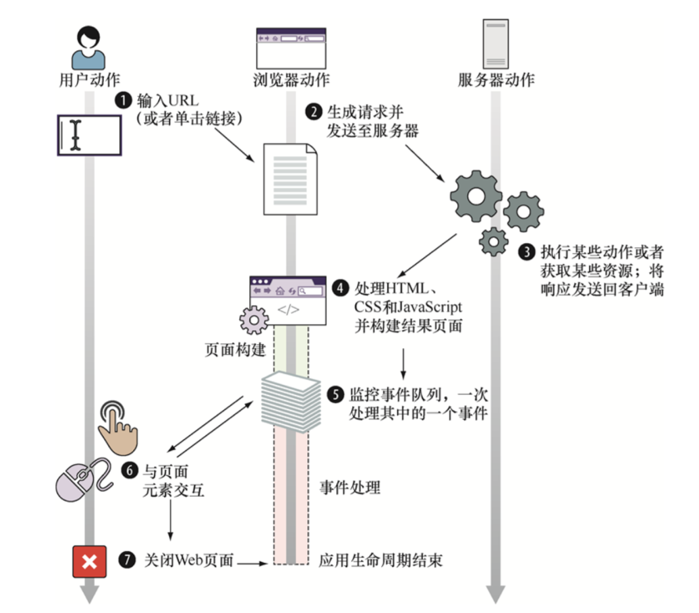
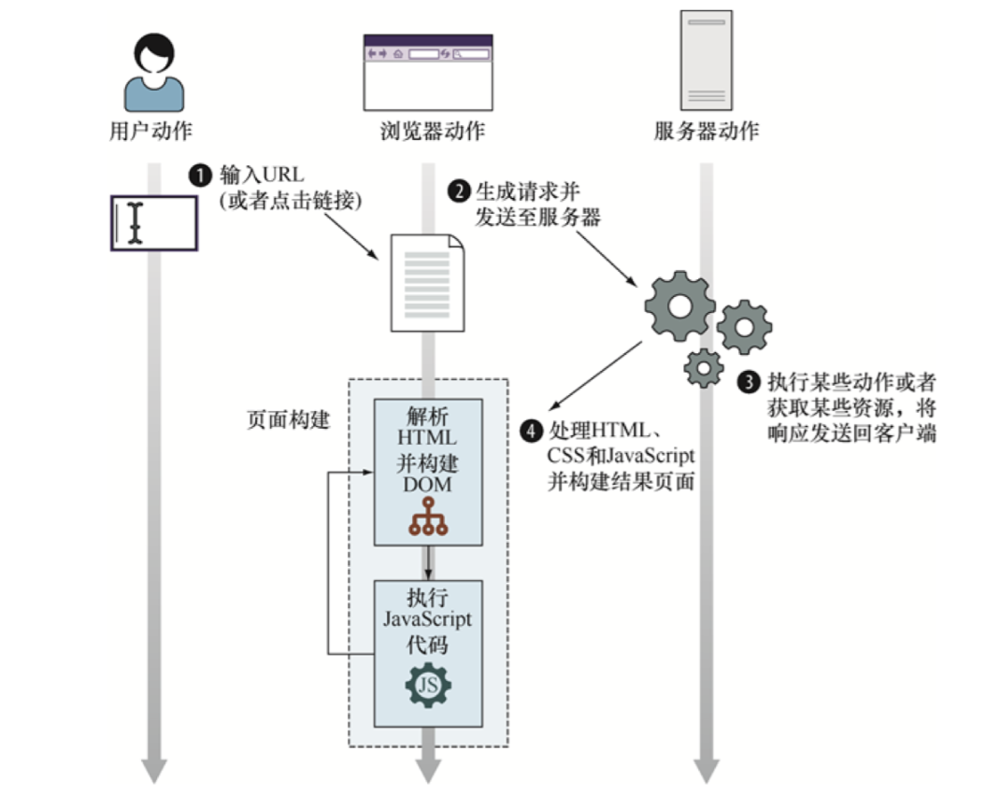
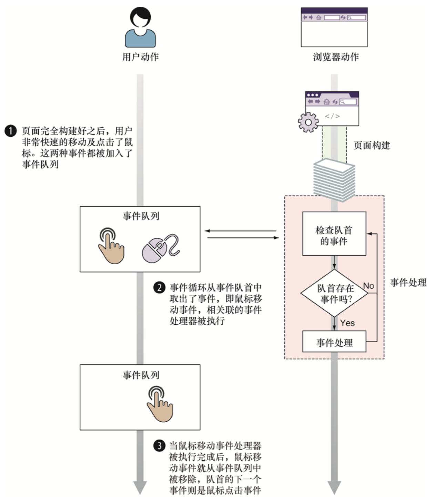

# JavaScript 忍者秘籍(第二版)
## 第二章 运行时的页面构建过程
### 生命周期概览
客户端Web应用的周期从用户指定某个网页地址或点击某个链接开始,其由两个步骤组成:页面构建和事件处理:



### 页面构建阶段
在Web应用被展示或交互之前,其页面必须根据服务器获取的响应来构建，构建过程主要包括两个步骤:
1. 解析HTML代码并构建文档对象模型
2. 执行JavaScript代码



#### HTML解析和DOM构建
在页面构建阶段，浏览器会遇到特殊类型的HTML元素--脚本元素`<script>`。每当解析到脚本元素，浏览器就会停止从HTML构建DOM，并开始执行JS代码
#### 执行JS代码
##### JS中的全局对象
全局window对象最重要的属性为document,代表了当前页面的DOM。
### 事件处理



## 第三章 函数：定义与参数
### 函数作为对象的乐趣
通过给函数添加属性可以:
- 在集合中存储函数使我们轻易管理相关联的函数,例如某些特定情况下必须调用的会调函数
- 让函数记忆上次计算得到的值以提高后续调用的性能

#### 存储函数
```javascript
const store = {
  nextId: 1,
  cache: {},
  add: function(fn) {
    if(!fn.id) {
      fn.id = this.nextId++;
      this.cache[fn.id] = fn;
      return true;
    }
    return false;
  },
};
```
通过为加入的函数分配id属性并将其作为属性增加到cache上来防止重复添加函数;另一种技巧是使用函数属性时,可以通过该属性修改函数自身,可以用于记忆前一个计算得到的值，为之后计算节省时间。
#### 自记忆函数
```javascript
function isPrime(value) {
  if(!isPrime.answers) {
    // 创建缓存
    isPrime.answers = {};
  }
  if(isPrime.answers[value] !== undefined) {
    return isPrime.answers[value];
  }
  let prime = value !== 0 && value !== 1;
  for(let i = 2; i < value; i++) {
    if(value % i === 0) {
      prime = false;
      break;
    }
  }
  return isPrime.answers[value] = prime;
}
```
记忆画是一种构建函数的处理过程，能够记住上次的计算结果，对于动画中的计算、搜索不常变化的数据或任何耗时的数学计算来说，记忆化十分有用。
### 函数定义
有四类定义函数的方式:
- 函数定义和函数表达式
- 箭头函数(lambda函数)
- 函数构造函数(不常用)
- 生成函数:能够使我们创建不同于普通函数的函数，在应用执行过程中，这种函数能够退出再重新进入，在这些再进入之间保留函数内变量的值。

### 函数的实参和形参
#### 剩余参数
为函数的最后一个命名参数前加上省略号前缀，这个参数就变成了一个叫做剩余参数的数组，数组内包含着传入的剩余的参数。
## 第四章 理解函数调用
### 隐式函数参数
#### arguments参数
- arguments对象是一个类数组结构。
- 将argument对象作为函数的别名使用会影响代码的可读性，因此在严格模式中将无法使用它。
- 严格模式下，改变arguments的值不会引起传入参数的变化。

#### this参数:函数上下文
this参数代表函数调用相关联的对象，因此也被称为函数上下文。this参数的指向不仅由定义函数的方式和位置决定，还收到函数调用方式的影响。
### 函数调用
- 作为函数调用:直接调用
- 作为方法:关联在对象上
- 作为构造函数
- 通过call或apply方法调用

#### 作为函数直接调用
在非严格模式下,this为全局上下文(global对象);严格模式下,this为undefined。
#### 作为方法调用
当一个函数被赋值给一个对象的属性，并通过对象属性引用的方式调用函数时，函数会作为对象的方法被调用，且该对象会成为函数的上下文。
#### 作为构造函数调用
使用关键字new调用函数会触发以下几个动作:
1. 创建一个新的空对象
2. 该对象作为this参数传递给构造函数
3. 新构造的对象作为new运算符的返回值

##### 构造函数返回值
- 若构造函数返回一个对象，则该对象将作为整个表达式的只返回，而传入构造函数的this将被丢弃。
- 若构造函数返回的是非对象类型，则忽略返回值，返回新创建的对象。

### 解决函数上下文问题
#### 使用箭头函数绕过函数上下文
箭头函数没有单独的this值,箭头函数的this与声明所在的上下文相同。
#### 使用bind方法
bind()返回一个新函数，并绑定到传入的参数上