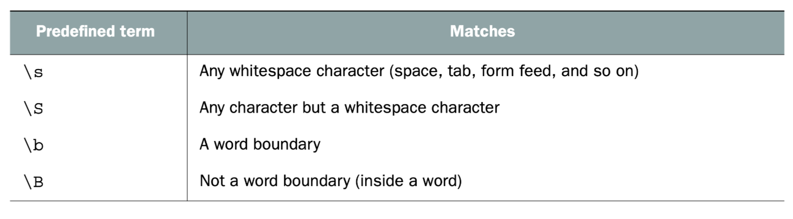

# JavaScript 忍者秘籍(第二版)
## 第二章 运行时的页面构建过程
### 生命周期概览
客户端Web应用的周期从用户指定某个网页地址或点击某个链接开始,其由两个步骤组成:页面构建和事件处理:


### 页面构建阶段
在Web应用被展示或交互之前,其页面必须根据服务器获取的响应来构建，构建过程主要包括两个步骤:
1. 解析HTML代码并构建文档对象模型
2. 执行JavaScript代码


#### HTML解析和DOM构建
在页面构建阶段，浏览器会遇到特殊类型的HTML元素--脚本元素`<script>`。每当解析到脚本元素，浏览器就会停止从HTML构建DOM，并开始执行JS代码
#### 执行JS代码
##### JS中的全局对象
全局window对象最重要的属性为document,代表了当前页面的DOM。
### 事件处理


## 第三章 函数：定义与参数
### 函数作为对象的乐趣
通过给函数添加属性可以:
- 在集合中存储函数使我们轻易管理相关联的函数,例如某些特定情况下必须调用的会调函数
- 让函数记忆上次计算得到的值以提高后续调用的性能

#### 存储函数
```javascript
const store = {
  nextId: 1,
  cache: {},
  add: function(fn) {
    if(!fn.id) {
      fn.id = this.nextId++;
      this.cache[fn.id] = fn;
      return true;
    }
    return false;
  },
};
```
通过为加入的函数分配id属性并将其作为属性增加到cache上来防止重复添加函数;另一种技巧是使用函数属性时,可以通过该属性修改函数自身,可以用于记忆前一个计算得到的值，为之后计算节省时间。
#### 自记忆函数
```javascript
function isPrime(value) {
  if(!isPrime.answers) {
    // 创建缓存
    isPrime.answers = {};
  }
  if(isPrime.answers[value] !== undefined) {
    return isPrime.answers[value];
  }
  let prime = value !== 0 && value !== 1;
  for(let i = 2; i < value; i++) {
    if(value % i === 0) {
      prime = false;
      break;
    }
  }
  return isPrime.answers[value] = prime;
}
```
记忆画是一种构建函数的处理过程，能够记住上次的计算结果，对于动画中的计算、搜索不常变化的数据或任何耗时的数学计算来说，记忆化十分有用。
### 函数定义
有四类定义函数的方式:
- 函数定义和函数表达式
- 箭头函数(lambda函数)
- 函数构造函数(不常用)
- 生成函数:能够使我们创建不同于普通函数的函数，在应用执行过程中，这种函数能够退出再重新进入，在这些再进入之间保留函数内变量的值。

### 函数的实参和形参
#### 剩余参数
为函数的最后一个命名参数前加上省略号前缀，这个参数就变成了一个叫做剩余参数的数组，数组内包含着传入的剩余的参数。
## 第四章 理解函数调用
### 隐式函数参数
#### arguments参数
- arguments对象是一个类数组结构。
- 将argument对象作为函数的别名使用会影响代码的可读性，因此在严格模式中将无法使用它。
- 严格模式下，改变arguments的值不会引起传入参数的变化。

#### this参数:函数上下文
this参数代表函数调用相关联的对象，因此也被称为函数上下文。this参数的指向不仅由定义函数的方式和位置决定，还收到函数调用方式的影响。
### 函数调用
- 作为函数调用:直接调用
- 作为方法:关联在对象上
- 作为构造函数
- 通过call或apply方法调用

#### 作为函数直接调用
在非严格模式下,this为全局上下文(global对象);严格模式下,this为undefined。
#### 作为方法调用
当一个函数被赋值给一个对象的属性，并通过对象属性引用的方式调用函数时，函数会作为对象的方法被调用，且该对象会成为函数的上下文。
#### 作为构造函数调用
使用关键字new调用函数会触发以下几个动作:
1. 创建一个新的空对象
2. 该对象作为this参数传递给构造函数
3. 新构造的对象作为new运算符的返回值

##### 构造函数返回值
- 若构造函数返回一个对象，则该对象将作为整个表达式的只返回，而传入构造函数的this将被丢弃。
- 若构造函数返回的是非对象类型，则忽略返回值，返回新创建的对象。

### 解决函数上下文问题
#### 使用箭头函数绕过函数上下文
箭头函数没有单独的this值,箭头函数的this与声明所在的上下文相同。
#### 使用bind方法
bind()返回一个新函数，并绑定到传入的参数上
## 第五章 闭包和作用域
### 理解闭包
当在外部函数中声明内部函数时，不仅定义了函数的声明，还创建了一个闭包。该闭包不仅包括了函数的声明，还包含了在函数声明时该作用域中的所有变量。当最终执行内部函数时，尽管声明时的作用域已经消失，但是通过闭包依然能够访问到原始作用域。每个通过闭包访问变量的函数都具有一个作用域链，作用域链包含闭包的全部信息。因此闭包虽然十分有用，但不能过度使用。
### 使用闭包
#### 封装私有变量
我们可以通过闭包内部方法获取私有变量的值，因为闭包内部的变量可以通过闭包内的方法访问，构造器外部的代码则不能方位闭包内部的变量。
### 通过执行上下文来跟踪代码
JavaScript中有两种执行上下文:全局执行上下文(只有一个)和函数执行上下文。
### 使用词法环境跟踪变量的作用域
词法环境(lexical environment)是JavaScript引擎内部用来跟踪标识符与特定变量之间的映射关系:
```javascript
var ninja = 'Hattori';
console.log(ninja);
```
当console.log语句访问ninja变量时，会进行词法环境的查询。
词法环境是JavaScript作用域的内部实现机制。在作用域范围内，每次执行代码时，代码结构都获得与之关联的词法环境。
#### 代码嵌套与词法环境
如果在当前环境中无法找到某一标识符，就会对外部环境进行查找，一旦找到匹配的变量，或是在全局环境中仍然无法查找到对应的标识符而返回错误，就会停止查找。每个执行上下文都有一个与之关联的词法环境，词法环境包含了在上下文中定义的标识符的映射表。无论何时创建函数，都会创建一个与之相关联的词法环境，并存储在名为`[[Environment]]`的内部属性上(也就是说无法直接访问或操作)。无论何时调用函数，都会创建一个新的执行环境，被推入执行上下文栈。并且JavaScript引擎会将调用函数的内置`[[Environment]]`属性与创建函数时的环境进行关联。
### 理解JavaScript的变量类型
#### 变量可变性
##### const变量
声明时需要初始化，声明完成后，无法更改其值。一般用于不需要重新赋值的特殊变量或指向一个固定的值。
#### 定义变量的关键字与词法环境
##### 关键字var
通过var声明的变量会在距离最近的函数内或全局词法环境中注册，不关注块级作用域。
#### 在词法环境中注册标识符
JavaScript代码的执行分两个阶段进行:
- 第一阶段:没有执行代码，JavaScript引擎会访问并注册当前词法环境中所声明的变量和函数
- 第二阶段:
  1. 若创建一个函数环境，则创建形参及函数参数的默认值。若为非函数环境，跳过此步。
  2. 若创建全局或函数环境，则扫描当前代码进行函数声明(不会扫描其他函数的函数体和函数表达式或箭头函数的函数声明)。对于找到的函数声明，将创建函数，并绑定到当前环境与函数名相同的标识符上。若标识符已经存在，则该标识符的值将被重写。若为块级作用域，跳过此步。
  3. 扫描当前代码进行变量声明。函数或全局环境中，查找所有当前函数以及其他函数外通过var声明的变量，并查找所有通过let或const定义的变量。在块级环境中，仅查找当前块中通过let或const定义的变量。对于所查找到的变量，若该标识符不存在，进行注册并将其初始化为undefined。若该标识符已存在，保留其值。


##### 函数重载
```javascript
assert(typeof fun === 'function', 'we access the function');

var fun = 3;
assert(typeof fun === 'number', 'now we access the number');

function fun() {}

assert(typeof fun === 'number', 'still a number');
```
注册函数声明时，标识符fun已存在，且并未赋值为undefined，因此第一个断言通过；之后fun被赋值为3，所以第二个断言通过；程序的实际执行过程中，跳过了函数声明部分，所以函数声明不会影响标识符的值，第三个断言通过。
### 研究闭包的工作原理
#### 回顾使用闭包模拟私有变量的代码
每次调用构造函数时，都会创建一个新的词法环境，该词法环境保持构造函数内部的局部变量。此外，无论何时创建函数，被创建的函数都会通过内置`[[Environment]]`保持对词法环境的引用。
#### 私有变量的警告
在JavaScript中没有真正的私有对象属性，但是可以通过闭包实现一种可接受的"私有"变量的方案。虽然不是真正的私有变量，但是许多开发者发现这是一种隐藏信息的有用方式。
## 第六章 生成器和Promise
生成器是一种特殊类型的函数。当从头到尾运行标准函数时，它最多只生成一个值。然而生成器函数会在几次运行请求中暂停，因此每次运行都可能会生成一个值。<br/>
promise对象是一个占位符，暂时替代那些尚未计算出但未来会计算出的值。
### 使用生成器函数
生成器(generator)函数能生成一组值的序列，但每个值的生成是基于每次请求，并不同于标准函数那样立即生成。我们必须显式地向生成器请求一个新的值，随后生成器要么响应一个新生成的值，要么就告诉我们它之后都不会再生成新的值。每当生成器函数生成了一个值，它都不会像普通函数一样停止执行。当对另一个值的请求到来后，生成器就会从上次离开的位置恢复执行。<br/>
调用生成器并不会执行生成器函数，相反，会创建一个叫做迭代器(iterator)的对象。
### 通过迭代器对象控制生成器
调用生成器后，就会创建一个迭代器(iterator)。迭代器用于控制生成器的执行。迭代器对象暴露的最基本的接口是next方法，用于向生成器请求一个值，从而控制生成器。<br/>
next函数调用后，生成器就开始执行代码，当代码执行到yield关键字时，就会生成一个中间结果(生成值序列中的一项)，然后返回一个新对象，其中封装了结果值和一个指示完成的指示器。<br/>
每当生成一个当前值之后，生成器就会非阻塞地挂起执行，随后耐心等待下一次值请求的到达。
#### 对迭代器进行迭代
通过调用生成器得到的迭代器，暴露出一个next方法能让我们向迭代器请求一个新值。next方法返回一个携带生成值的对象，而该对象包含的另一个属性done也向我们指示了生成器是否还会追加生成值。
```javascript
function* WeaponGenerator() {
  yield 'Katana';
  yield 'Wakizashi';
}

const weaponsIterator = WeaponGenerator();
let item;
while(!(item = weaponsIterator.next()).done) {
  assert(item !== undefined, item.value);
}
```
这就是for-of循环的原理，for-of循环只不过是对迭代器进行迭代的语法糖。不同于手动调用迭代器的next方法，for-of循环同时还要查看生成器是否完成。
#### 把执行权交给下一个生成器
在迭代器上使用yield*操作符，程序会跳转到另一个生成器上执行。
### 使用生成器
#### 与生成器交互
##### 作为生成器函数参数发送值
向生成器发送值的最简方法就是调用并传入实参
##### 使用next方法向生成器发送值
除了第一次调用生成器的时候向生成器提供数据，我们还能通过next方法向生成器传入参数。在这个过程中，我们把生成器函数从挂起状态恢复到了执行状态。在当前挂起的生成器中，生成器把这个传入的值用于整个yield表达式。<br/>
我们通过yield语句从生成器中返回值，在使用迭代器的next方法把值传回生成器，以此在生成器中双向通信。
##### 抛出异常
```javascript
function* NinjaGenerator() {
  try {
    yield 'Hattori';
    fail('The expected exception didn\'t occur');
  } catch (error) {
    assert(error === 'Catch this!', 'Aha! we caught an expection');
  }
}
const ninjaIterator = NinjaGenerator();

const result1 = ninjaIterator.next();
assert(result1.value === 'Hattori', 'we got Hattori');

ninjaIterator.throw('Catch this!');
```
上述代码将异常抛回到了生成器中。
#### 探索生成器内部构成
调用生成器实际上不会执行它，相反，会创建一个新的迭代器，通过迭代器我们能够从生成器中请求值。在生成器生成或让渡了一个值后，生成器会挂起执行并等待下一个请求的到来。在某种方面上看，生成器更像是一个在状态中运动的状态机:
- 挂起开始: 创建生成器后，最先以这种状态开始，其中任何代码都未执行。
- 执行: 生成器中的代码在这种状态下执行。
- 挂起让渡: 当生成器的执行过程中遇到了一个yield表达式，他会创建并让渡一个包含着返回值的新对象，随后再挂起到执行状态。
- 完成: 在生成器执行期间，若代码执行到return语句或全部代码执行完毕，生成器就进入该状态。


##### 通过执行上下文跟踪生成器函数
控制流进入生成器函数时，会创建一个新的函数环境上下文，并将该上下文入栈。生成器不会执行任何函数代码，相反地，会生成并返回一个迭代器。由于迭代器用于控制生成器的执行，所以迭代器中保存了一个它创建时的执行上下文。<br/>
一般情况下，当程序从一个标准函数返回后，对应的执行环境上下文会从栈中弹出，并被完整的销毁。但当执行流离开生成器时，对应的上下文会从栈中弹出，但迭代器对象保存着对它的引用，因此不会被销毁。当调用迭代器的next方法时，生成器会重新激活对应的执行上下文，并将其放入栈顶，从上次离开的位置继续执行。<br/>
当我们从生成器中取得控制权后，生成器的执行环境上下文一直是保存的，而不像标准函数一样退出后销毁。
### 使用Promise
使用构造函数来创建一个promise需要传入一个函数。这个函数被称为执行函数，包含resolve和reject两个参数。
#### 理解简单回调函数所带来的问题
- 错误难处理
- 连续执行步骤棘手
- 执行很多并行任务同样棘手

#### 深入研究promise
promise对象用于作为异步任务结果的占位符，代表了一个我们暂时还没获得但未来有希望获得的值。在一个promise对象的整个生命周期中，它会经历多种状态:


JavaScript在主线程的所有代码都执行完毕后。调用then回调函数来处理任务队列中的promise。
#### 创建第一个真实promise案例
```javascript
function getJSON(url) {
  return new Promise((resolve, reject) => {
    const request = new XMLHttpRequest();

    request.open('GET', url);

    request.onload = function() {
      try {
        if (this.status === 200) {
          resolve(JSON.parse(this.response));
        } else {
          reject(`${this.status} ${this.statusText}`);
        }
      } catch (error) {
        reject(error.message);
      }
    };

    request.onerror = function() {
      reject(`${this.status} ${this.statusText}`);
    };

    request.send();
  });
}

getJSON('data/ninjas.json').then(ninja => {
  if (ninjas !== null) {
    console.log('Ninjas obtained!');
  }
}).catch(e => console.log(`Shouldn't be here: ${e}`));
```
XMLHttpRequest包含两种事件: onload和onerror。当浏览器从服务器端接收到了一个响应，onload事件就会被触发，当通信出错则会触发onerror事件。
#### 等待多个promise
除了处理相互依赖的异步任务序列以外，对于等待多个独立的异步任务，promise也能够显著减少代码量。
```javascript
Promise.all([
  getJSON('./data/ninjas.json'),
  getJSON('./data/mapInfo.json'),
  getJSON('./data/plan.json')
]).then(results => {
  const ninjas = results[0],
        mapInfo = results[1],
        plan = results[2];
  if (
    ninjas !== undefined &&
    mapInfo !== undefined &&
    plan !== undefined
    ) {
      console.log(`The plan is ready to be set in motion!`);
    }
}).catch(err => {
  console.log(`A problem in carrying out our plan`);
});
```
通过使用内置Promise.all可以等待多个promise。这个方法接收一个promise数组，然后创建一个新promise对象，一旦数组中的promise全被解决，这个返回的promise就会被解决，而一旦其中有一个promise失败了，整个新promise对象也会被拒绝。后续的回调函数接受成功值组成的数组，其中的每一项都对应promise数组中的对应项。
#### promise竞赛
```javascript
Promise.race([
  getJSON('./data/yoshi.json'),
  getJSON('./data/hattori.json'),
  getJSON('./data/hanzo.json')
]).then(ninja => {
  if (ninja !== null) {
    console.log(`${ninja.name} responded first`);
  }
}).catch(err => {
  console.log(`Failure!`);
});
```
使用Promise.race方法并传入一个promise数组会返回一个全新的promise对象，一旦数组中某个promise被处理或被拒绝，这个返回的promise就同样会被处理或被拒绝。
### 把生成器和promise相结合
```javascript
try {
  const ninjas = syncGetJSON("data/ninjas.json");
  const missions = syncGetJSON(ninjas[0].missionsUrl);
  const missionDetails = syncGetJSON(missions[0].detailsUrl);
} catch(e) {
  // Oh no, we weren't able to get the mission details
}
```
同步方法会阻塞UI，我们可以修改使其运行长时间运行的任务时不会发生阻塞。一种方法是将生成器和promise相结合。生成器让渡后会挂起执行而不会发生阻塞，我们可以调用迭代器的next方法就可以唤醒生成器继续执行代码。而promise允许指定两个回调函数，分别在能够获得预先保证的值和错误发生时触发。<br/>
我们这样组合生成器和promise:我们将执行异步操作的代码放入生成器，然后执行生成器。当生成器内执行了一项异步操作时，一个代表当前异步操作返回值的promise会被创建。由于我们在生成器执行时无法知道promise是否会成功兑现，所以我们挂起生成器以免造成阻塞。当一会promise的状态确定后，我们通过调用迭代器的next方法继续执行生成器。只要有需要就可以重复这个过程:
```javascript
async (function* () {
  try {
    const ninjas = yield getJSON('./data/ninjas.json');
    const missions = yield getJSON(ninjas[0].missionsUrl);
    const missionDescription = yield getJSON(missions[0].detailsUrl);
    console.log(missionDescription);
  } catch (e) {
    console.log(e);
  }
});

function async(generator) {
  const iterator = generator();

  function handle(iteratorResult) {
    if (iteratorResult.done) {
      return ;
    }

  const iteratorValue = iteratorResult.value;
  // 若生成器的值为promise 则对其进行异步处理
  if (iteratorValue instanceof Promise) {
    iteratorValue
      .then(res => handle(iterator.next(res)))
      .catch(err => iterator.throw(err));
  }
}

  try {
    handle(iterator.next());
  } catch (e) {
    iterator.throw(e);
  }
}
```
### 面向未来的async函数
可以看到我们仍然需要书写一些样板代码，因此我们需要一个async函数能够管理所有promise函数的调用和所有向生成器发出的请求。可以使用async和await关键字来替代上述样板代码:
```javascript
(async function() {
  try {
    const ninjas = await getJSON('./data/ninjas.json');
    const missions = await getJSON(ninjas[0].missionsUrl);
    const missionDescription = await getJSON(missions[0].detailsUrl);
    console.log(missionDescription);
  } catch (e) {
    console.log(e);
  }
})();
```
通过在关键字function前使用关键字async，可以表明当前函数依赖一个异步返回的值。在调用异步任务的每一处使用await关键字来告诉JavaScript引擎，请在不阻塞应用执行的情况下在这个位置上等待执行结果。
## 第七章 面向对象与原型
### 理解原型
使用操作符`in`来测试对象是否包含某个特定的属性。JS中对象的原型属性属于内置属性，无法直接访问(因此被标记为`[[prototype]]`)。然而，内置方法`Object.setPrototypeOf`可以接受两个对象作为参数，并把第二个对象设置为第一个对象的原型。<br/>
每个对象都可以有一个原型，每个对象的原型也可以拥有一个原型，以此形成一个原型链。查找特定属性会被委托到整条原型链上，只有在没有原型可以查找时才会停止(或者已经找到了该属性)。
### 对象构造器与原型
每个函数都有一个原型对象，且会被自动被设为由该函数创建的对象的原型。使用`new`操作符调用函数会创建一个新对象并将其设置为该函数的上下文(可通过`this`关键字访问)。`new`操作符返回的结果是这个新对象的引用。


#### 实例属性
当把函数作为构造函数通过`new`操作符调用时，其上下文会被定义为新的对象实例。除了通过原型来暴露对象中的属性外，我们还可以通过`this`关键字来初始化构造函数中的值。


在原型链上搜索属性时，若该属性能在该对象本身找到，则不会再在原型链上找。


每一个实例都有构造函数内构建的属性的独立拷贝，但他们同样可以访问同一个原型属性。暴露出的问题: 同样的`swingSword`方法被独立创建，在创建大量实例时会导致内存的浪费。因此可以选择只在原型上创建对象方法，这样可以使同一个方法被所有对象实例共享。<br/>
注意: 若要在构造函数内使用闭包来模仿私有对象变量，只能在构造函数里定义方法。
#### JavaScript动态特性的副作用


在实例被创建后对原型做更改，该实例依旧能够访问。


构造函数的原型可以任意替换，但已经创建的实例依旧引用旧的原型对象。


而新创建的实例引用新的原型对象。

#### 通过构造函数了解对象类型
一个对象的构造函数可以通过其构造函数的原型的`constructor`属性访问到。通过使用`constructor`属性，我们可以访问创建该对象时所使用的函数。我们可以使用`constructor`属性验证实例的原始类型(与`instanceof`操作符类似)，还可以直接使用`constructor`属性来创建实例。这使得我们可以在不需要访问原始构造函数的情况下就可以直接创建对象，即使构造函数不再作用域内，也可以使用构造函数的引用。
### 实现继承


我们可以通过把父类的实例设置为子类的原型来实现继承。这种原型实现继承的方式的副作用好的一面是，所有继承函数的原型将实时更新。继承了原型的对象总是可以访问到当前的原型属性。

注意: 强烈不推荐直接使用父类的原型作为子类的原型，如(Child.prototype = Parent.prototype)。这样做会导致父类原型上发生的所有变化都会同步到子类原型上，必定会导致我们不想要的副作用。
#### 重写constructor属性导致的问题
从上图可以看出，将Person的新实例设置为Ninja构造函数的原型时，我们丢失了Ninja与初始原型之间的关联。这会导致一些问题，因为初始原型中的constructor属性可以用于确定对象是由哪个函数构建的。
##### 配置对象属性
在JS中，每个对象属性都由一个属性描述进行描述的，我们可以配置以下关键字:
- `configurable`: 若为true，可以修改或删除属性。若为false，不允许修改和删除。默认为true。
- `enumerable`: 若为true，则可以在for-in循环对象属性时出现。默认为true。
- `value`: 指定属性的值，默认为undefined。
- `writable`: 若为true，则可以通过赋值语句修改属性值。默认为true。
- `get`: 定义getter函数，当访问属性时调用，不能与value和writable属性同时使用。默认为undefined。
- `set`: 定义setter函数，当对属性赋值时调用，不能与value和writable属性同时使用。默认为undefined。

如果想要调整属性的配置信息，我们可以使用内置的`Object.defineProperty`方法，传入属性所在对象，属性名和属性描述对象。
#### instanceof操作符
`instanceof`操作符用于检测对象是否存在与另一对象构造函数当前的原型链中。


虽然`instanceof`操作符最常见的用途是确定一个实例是否由一个特定的构造函数所创建的，但事实上并不是这么做的，它会检查操作符右边的函数的原型是否存在于左边对象的原型链上。
##### instanceof操作符的警告


注意原型改变时的情况

### 使用ES6中的class
虽然现在可以在JavaScript使用关键字`class`，但其底层实现仍然基于原型继承。
#### 使用class关键字
##### 静态方法
在函数前使用`static`关键字来声明一个静态方法,ES6之前版本的实现方式:
```javascript
function Ninja() {}
Ninja.compare = function(ninja1, ninja2) {...}
```
##### 实现继承
ES6前的实现方式:
```javascript
function Person() {}
Person.prototype.dance = function() {};

function Ninja() {}
Ninja.prototype = new Person();

Object.defineProperty(Ninja.prototype, 'constructor', {
  enumerable: false,
  value: Ninja,
  writable: true
});
```
记住一点:实例方法应该被直接添加在构造函数原型上，如Person构造函数上的dance方法。为了实现继承，我们必须把父类的实例设置为子类的原型。但通过此方式会导致`constructor`属性的丢失，因此需要使用`Object.defineProperty`方法进行手动设置。在ES6中，大大简化了整个过程:
```javascript
class Person {
  constructor(name) {
    this.name = name;
  }

  dance() {
    return true;
  }
}

class Ninja extends Person {
  constructor(name, weapon) {
    super(name);
    this.weapon = weapon;
  }

  wieldWeapon() {
    return true;
  }
}
```
## 第八章 控制对象的访问
### 使用getter和setter控制属性访问
#### 定义getter和setter
在JS中，getter和setter有两种定义方式:
- 通过字面量或ES6中的class定义
- 使用内置`Object.defineProperty`方法

```javascript
// 通过字面量定义
const ninjaCollection = {
  ninjas: ['Yoshi', 'Kuma', 'Hattori'],
  get firstNinja() {
    console.log('getting firstNinja');
    return this.ninjas[0];
  },
  set firstNinja(value) {
    console.log('setting firstNinja');
    this.ninjas[0] = value;
  }
};

// 通过class定义
class NinjaCollection {
  constructor() {
    this.ninjas = ['Yoshi', 'Kuma', 'Hattori'];
  }

  get firstNinja() {
    console.log('getting firstNinja');
    return this.ninjas[0];
  }
  set firstNinja(value) {
    console.log('setting firstNinja');
    this.ninjas[0] = value;
  }
}
```
原生getter和setter方法允许我们像标准属性一样使用访问器属性，当访问器属性被访问时，这些方法会被立刻执行。


对于给定属性，我们不必同时定义getter和setter。如通常我们只提供getter。若我们在某些情况下需要写入该属性，具体行为取决于代码是否处于严格模式。非严格模式下，JS引擎会忽略我们的请求；严格模式下，JS引擎会抛出异常，表示我们将给一个仅有getter没有setter的属性赋值。
```javascript
// 使用Object.defineProperty定义
function Ninja() {
  let _skillLevel = 0;

  Object.defineProperty(this, 'skillLevel', {
    get: () => {
      console.log('The get method is called');
      return _skillLevel;
    },
    set: value => {
      console.log('The set meyhod is called');
      _skillLevel = value;
    }
  });
}
```
与在对象字面量和类中定义不同，通过`Object.defineProperty`定义的get和set方法与私有变量`skillLevel`在同一个作用域内，分别创建了一个包含了该变量的闭包，我们只能通过这两个方法访问该属性。
#### 使用getter和setter校验属性值
```javascript
function Ninja() {
  let _skillLevel = 0;

  Object.defineProperty(this, 'skillLevel', {
    get: () => _skillLevel,
    set: value => {
      if (!Number.isInteger(value)) {
        throw new TypeError('Skill level should be a number');
      }
      _skillLevel = value;
    }
  });
}
```
你可以使用同样的规则来跟踪值的变化，提供性能日志和提供值发生变化的提示等。
#### 使用getter和setter定义计算属性
```javascript
const shogun = {
  name: 'Yoshiaki',
  clan: 'Ashikaga',
  get fullTitle() {
    return `${this.name} ${this.clan}`;
  },
  set fullTitle(value) {
    const segments = value.split(' ');
    this.name = segments[0];
    this.clan = segments[1];
  }
};
```
### 使用代理控制访问
我们控制通过代理来控制对另一个对象的访问。它使我们能够定义对象交互时执行的自定义行为。代理可以被理解为通用化的getter和setter，他们的区别在于getter和setter只能控制单个属性，而代理可以用于对象交互的通用处理，包括方法的调用。
```javascript
const emperor = { name: 'Komei'};
const representative = new Proxy(emperor, {
  get: (target, key) => {
    console.log(`Reading ${key} through a proxy`);
    return key in target ? target[key]
                         : `Donnot bother the emperor!`;
  },
  set: (target, key, value) => {
    console.log(`Writing ${key} through a proxy`);
    target[key] = value;
  }
});
```
通过使用内置的Proxy构造函数，我们将emperor对象(通常称为目标对象，target)包装成代理对象(representative)。在代理构造时，我们同时传入一个定义了traps的对象。traps是一些在对象执行特定行为时被调用的函数。其中，get trap会在通过代理读取对象属性时调用；set trap会在通过代理写入属性值时被调用。


一旦我们执行了一个操作(如访问代理对象属性),就会隐式调用对应的get方法。此时JS引擎的执行过程与显示调用的普通函数类似。

以下是一些其他的内置trap用于定义对象的交互行为的处理:
- `apply` and `construct` trap: 调用函数时激活`apply`,使用new操作符时激活`construct`
- `get` and `set` trap: 分别在读取/写入属性时被激活
- `enumerate` trap: 执行for-in语句时被激活
- `getPrototypeOf` and `setPrototypeOf` trap: 获取和设置原型属性值时被激活

相等( === 或 == )、instanceof和typeof操作符无法被拦截:比如，表达式 x == y 用于验证x和y是否指向相同对象或相同的值。相等操作具有一些假定前提。比如被比较的两个对象总是能返回相同的值，若这个值由用户指定的函数返回，则无法被保证。
#### 使用代理记录日志
```javascript
function Ninja() {
  let _skillLevel = 0;
  Object.defineProperty(this, 'skillLevel', {
    get: () => {
      console.log(`skillLevel get method is called`);
      return _skillLevel;
    },
    set: value => {
      console.log(`skillLevel set method is called`);
      this._skillLevel = value;
    }
  });
}
```
使用getter和setter混合了属性读写的代码和日志代码，而且代码复用性差。
```javascript
function makeLoggable(target) {
  return new Proxy(target, {
    get: (target, property) => {
      console.log(`Reading ${property}`);
      return target[property];
    },
    set: (target, property, value) => {
      console.log(`Writing value ${value} to ${property}`);
      target[property] = value;
    }
  });
}
```
#### 使用代理检测性能
```javascript
function isPrime(num) {
  if (num < 2) {
    return false;
  }
  for (let i = 2; i < num; i++) {
    if(num % i === 0) {
      return false
    }
  }
  return true;
}
isPrime = new Proxy(isPrime, {
  apply: (target, thisArg, args) => {
    console.time(`isPrime`);
    const result = target.apply(thisArg, args);
    console.timeEnd(`isPrime`);
    return result;
  }
});
```
#### 使用代理自动填充属性
```javascript
function Folder() {
  return new Proxy({}, {
    get: (target, property) => {
      console.log(`Reading ${property}`);
      if (!(property in target)) {
        target[property] = new Folder();
      }
      return target[property];
    }
  });
}
```
若访问的属性不存在，会自动创建并赋值给该属性。
#### 使用代理实现负数组索引
```javascript
function createNegativeArrayProxy(array) {
  if (!Array.isArray(array)) {
    return new TypeError('Expected an array');
  }
  return new Proxy(array, {
    get: (target, index) => {
      index = +index;// 转成number
      return target[index < 0 ? target.length + index : index];
    },
    set: (target, index, value) => {
      index = +index;
      return target[index < 0 ? target.length + index : index] = value;
    }
  });
}
```
#### 代理的性能消耗
我们所有通过代理的操作都被添加了一层间接层，它导致了大量额外处理以此引起性能降低。<br/>
谨慎使用代理。可以在性能不敏感的程序中使用代理，但在会被大量执行的代码中使用代理需要谨慎处理。
## 第九章 处理集合
### 数组
JS中数组是对象
#### 创建数组
- 使用内置Array构造函数
- 使用数组字面量`[]`(推荐)

#### 在数组两端添加、删除元素
- push: 在末尾添加元素
- unshift: 在开头添加元素
- pop: 在末尾删除元素
- shift: 在末尾删除元素

建议尽可能使用pop和push方法，因为shift和unshift方法影响数组中第一个元素，因此原数组中每项的下标都需要被变动，性能相对pop和push而言更差。
#### 在数组任意位置添加、删除元素
使用delete操作符只会删除数组项的内容，数组项的位置仍旧保留。而使用内置spilce方法可以实现，splice方法分别接受起始索引、需要移除元素的个数，还有添加进数组的项，并返回被移除的项。
#### 数组常用操作
- 遍历数组: forEach
- 基于现有数组项映射创建新数组: map
- 验证数组元素是否匹配指定条件: some & every
- 查找指定数组项: find & filter
- 聚合数组，基于数组元素计算: reduce

### Map
#### 别把对象作用Map
- 对象属性会通过原型继承
- 对象仅支持字符串类型的key
##### key的相等性
```javascript
const map = new Map();
const currentLocation = 'http://www.baidu.com';

const firstLink = new URL(currentLocation);
const secondLink = new URL(currentLocation);

map.set(firstLink, { description: 'firstLink' });
map.set(secondLink, { description: 'secondLink' });

assert(map.get(firstLink).description === 'firstLink', 'First link mapping');
assert(map.get(secondLink).description === 'secondLink', 'Second link mapping');
assert(map.size === 2, 'There are two mappings');
```
虽然两个URL对象指向相同的URL地址，但这两个对象不相等，因此关联了两个映射。
#### 遍历map
因为map是集合，因此可以使用for-of来遍历map，而且可以确保遍历顺序与插入顺序一致(对象则无法保证)。
### Set
集合(Set)中的每个元素都是唯一的
#### Union并集
```javascript
const ninjas = new Set(['Kuma', 'Hattori', 'Yagyu']);
const samurai = new Set(['Hattori', 'Oda', 'Tomoe']);

const warriors = new Set([...ninjas, ...samurai]);
```
#### Intersect交集
```javascript
const ninjas = new Set(['Kuma', 'Hattori', 'Yagyu']);
const samurai = new Set(['Hattori', 'Oda', 'Tomoe']);

const ninjaSamurais = new Set(
  [...ninjas].filter(ninja => samurai.has(ninja))
);
```
#### Difference差集
```javascript
const ninjas = new Set(['Kuma', 'Hattori', 'Yagyu']);
const samurai = new Set(['Hattori', 'Oda', 'Tomoe']);

const ninjaSamurais = new Set(
  [...ninjas].filter(ninja => !samurai.has(ninja))
);
```
## 第十章 正则表达式
### 正则速成班
创建正则表达式有两种方式:
- 使用正则表达式字面量
- 通过创建RegExp对象的实例

若需要在运行时动态创建字符串来构建正则表达式时，则使用构造函数的方式，否则优先使用字面量语法。原因之一是反斜线在正则表达式中发挥了重要作用。但反斜杠也用于转义字符，因此，对于反斜线本身则需要使用双反斜线来标识。<br/>
修饰符:
- i: 对大小写不敏感 
- g: 查找所有匹配项，在查找到第一个匹配时不会停止，还会继续查找下一个匹配项
- m: 允许多行匹配，对获取textarea元素的值很有用
- y: 开启粘连匹配。规定要求匹配下标紧接着上一次匹配的开始去匹配
- u: 允许使用Unicode转义字符
### 术语和操作符
正则表达式由术语和操作符组成。
#### 精确匹配
除了非特殊字符或操作符之外，字符必须准确出现在表达式中。如`/test/`中的四个字符必须完全出现在所匹配的字符串中。`/test/`的意思是t后紧跟e，e后紧跟s，s后紧跟t。
#### 匹配字符集
当我们要匹配有限字符集中的任意一个字符时，我们可以通过将我们想要匹配的字符集合包裹在集合操作符(也叫字符类操作符)里来实现，如`[abc]`表示匹配啊a、b、c中的任意一个字符。若要匹配一组有限字符集以外的任意字符，可以在左括号后添加一个尖括号: `[^abc]`，此时表示匹配除了a、b、c外的任意一个字符。字符集还有一个更重要的操作：限定范围。例如匹配a与m之间的小写字母,`[a-m]`。中横线表示按字母顺序从a到m间所有字符的集合。<br/>
#### 转义
注意，不是所有字符和字符字面量都是等价的。特殊字符如`$`、`.`匹配的是其本身外的内容或表示操作符。如果要匹配这些字符，要使用反斜线对其后面的字符进行转义，如`\[`匹配`[`字符。
#### 起止符号
`^`当被用作正则表达式的第一个字符时，表示匹配字符串的开头，如`/^test/`表示匹配以test开头的的字符串。`$`表示字符串的结束，如`/test$/`。同时使用`^`与`$`表示匹配整个字符串。
#### 重复出现
- 指定可选字符(可出现0次或1次),在字符后添加`/ta?est`可以同时匹配test与taest。
- 指定字符必须出现一次或多次，使用`+`，如`/t+est/`可匹配test、ttest、tttest等。
- 指定字符出现0次、1次或多次，使用`*`,如`t*est`可匹配est、test、ttest、tttest等。
- 使用花括号指定重复次数，如`/a{4}/`，匹配四个连续的字符a
- 用逗号分隔来指定循环次数的范围，如`a{4,10}`匹配4～10个连续的字符a
- 忽略第二个值，保留逗号来指定开放区间，如`a{4,}`匹配四个及以上的连续字符a

这些运算符默认为贪婪模式，可以匹配所有可能的字符。在运算符后添加`?`，如a+?,使得运算符为非贪婪模式，值进行最小限度的匹配。对于字符串aaa，正则表达式`/a+/`会匹配全部三个字符，而非贪婪模式`/a+?/`则匹配一个字符a，因为一个字符a已经满足了a+术语
#### 预定义字符集
有些希望匹配的内容无法通过字符字面量来表示(如回车符)，有时我们还希望匹配字符集，如一组十进制数字或一组空格。正则表达式可以预定义表示这些字符或常用集合的元字符，这样我们就可以匹配控制字符，也不必对常用的字符集作特殊处理:




#### 分组
若对一组术语使用操作符，可以使用圆括号进行分组，如`/(ab)+/`匹配一个或多个连续的ab<br/>
正则的部分使用圆括号分组时具有两种功能，同时也创建捕获。
#### 或操作符
使用`|`表示或，如`/a|b/`表示可以匹配a或者b，`/(ab)+|(cd)+/`表示可以匹配一个或多个ab或者cd
#### 反向引用
正则表达式中最复杂的术语是反向引用，反向引用可以引用正则中定义的捕获。反向引用分组中捕获的内容，使用反斜线加上数字表示引用，该数字从1开始，第一个分组捕获的为`\1`，第二个为`\2`，以此类推。<br>
例如`^([dtn])a\1`匹配任意从d、t或n开始然后紧跟a，之后连接着第一组捕获的字符的字符串。换句话说，`\1`匹配的字符必须是第一组括号中匹配的字符。<br>
在匹配XML类型的标记元素时，反向引用很有用:
`/<(\w+)>(.+)<\/\1>/`这可以匹配简单的元素如`<strong>whatever</strong>`，若没有反向引用，则不乏知道与起始标记相匹配的结束标记是什么。
### 编译正则表达式
处理正则表达式主要分为编译阶段和执行阶段。编译发生在正则表达式创建的时候。执行阶段发生在我们用编译后的正则表达式匹配字符串的时候。<br/>
编译期间，表达式被JavaScript引擎解析然后转化成内部表示。每一次正则表达式被创建解析和转化过程都会发生(不考虑浏览器执行的内部优化)。<br/>
通常，相同的正则表达式被使用时，浏览器会缓存其编译结果。但不是各个浏览器都会这么做。对于复杂的表达式，我们可以通过预定义(预编译)使性能得到提升。首先，可以将编译后的正则表达式存在变量里以便复用(同样内容的正则表达式会被认为是不同的)；其次，使用RegExp构造函数可以动态创建表达式，可以节省大量性能开销。
### 捕获匹配的片段
#### 执行简单捕获
```html
<div id="square" style="transform:translateY(15px);"></div>
<script>
  function getTranslateY(elem) {
    const transformValue = elem.style.transform;
    if (transformValue) {
      const match = transformValue.match(/translateY\(([^\)]+)\)/);
      return match ? match[1] : '';
    }
    return '';
  }
  const square = document.getElementById('square');

  if (getTranslateY(square) === '15px') {
    console.log(`We've extracted the translateY value`);
  }
</script>
```
#### 使用全局表达式进行匹配
```javascript
const html = `<div class="test"><b>Hello</b> <i>world!</i></div>`;
const results = html.match(/<(\/?)(\w+)([^>]*?)>/);
assert(results[0] === '<div class="test">', 'The entire match.');
assert(results[1] === '', 'The (missing) slash');
assert(results[2] === 'div', 'The tag name.');
assert(results[3] === ' class="test"', 'The attributes.');

const all = html.match(/<(\/?)(\w+)([^>]*?)>/g);
assert(all[0] === "<div class='test'>", "Opening div tag.");
assert(all[1] === "<b>", "Opening b tag.");
assert(all[2] === "</b>", "Closing b tag.");
assert(all[3] === "<i>", "Opening i tag.");
assert(all[4] === "</i>", "Closing i tag.");
assert(all[5] === "</div>", "Closing div tag.");
```
使用局部匹配时，只有一个实例被匹配，并返回匹配中的捕获结果；使用全局匹配时，返回所匹配的全部内容列表。若捕获结果很重要，可以在全局匹配中使用正则表达式的`exec`方法。可多次对一个正则表达式调用exec方法，每次调用都会返回下一个匹配的结果。
```javascript
const html = `<div class="test"><b>Hello</b> <i>world!</i></div>`;
const tag = /<(\/?)(\w+)([^>]*?)>/g;
let match, num = 0;

while ((match = tag.exec(html)) !== null) {
  assert(match.length === 4, 'Every match finds each tag and 3 captures');
  num++;
}
assert(num === 6, '3 opening and 2 closing tags found');
```
#### 捕获的引用
对捕获结果进行引用有两种方式: 在自身匹配或替换字符串。<br/>
(现阶段先跳过)
