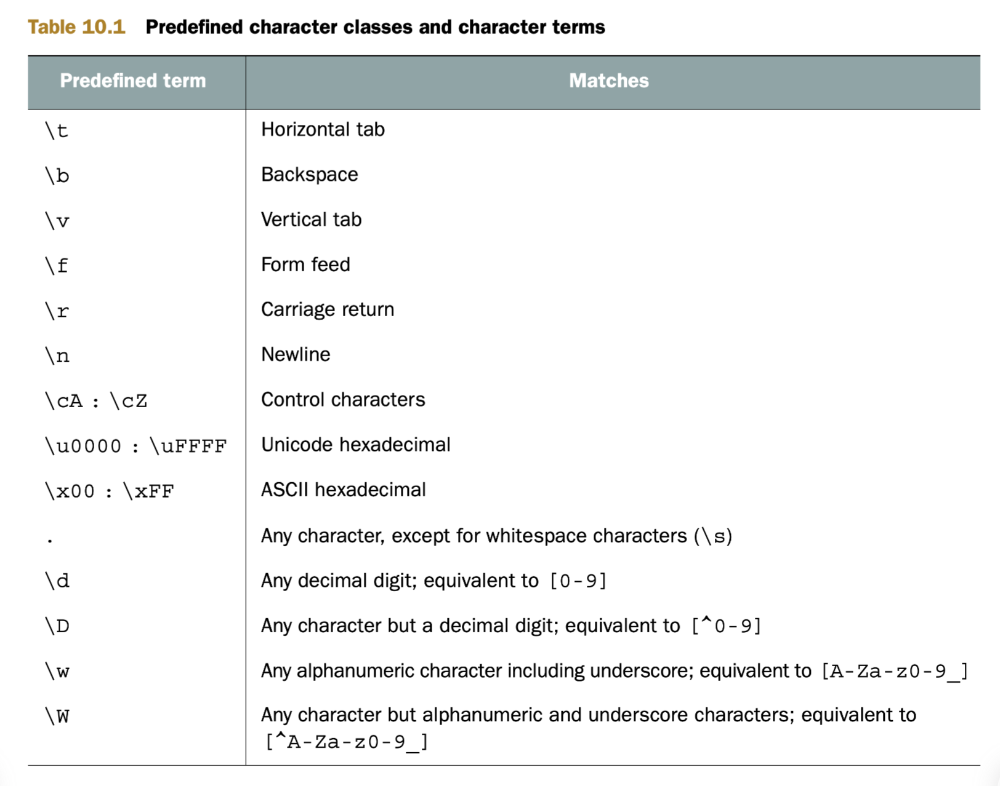

# JavaScript 忍者秘籍(第二版)
## 第二章 运行时的页面构建过程
### 生命周期概览
客户端Web应用的周期从用户指定某个网页地址或点击某个链接开始,其由两个步骤组成:页面构建和事件处理:


### 页面构建阶段
在Web应用被展示或交互之前,其页面必须根据服务器获取的响应来构建，构建过程主要包括两个步骤:
1. 解析HTML代码并构建文档对象模型
2. 执行JavaScript代码


#### HTML解析和DOM构建
在页面构建阶段，浏览器会遇到特殊类型的HTML元素--脚本元素`<script>`。每当解析到脚本元素，浏览器就会停止从HTML构建DOM，并开始执行JS代码
#### 执行JS代码
##### JS中的全局对象
全局window对象最重要的属性为document,代表了当前页面的DOM。
### 事件处理


## 第三章 函数：定义与参数
### 函数作为对象的乐趣
通过给函数添加属性可以:
- 在集合中存储函数使我们轻易管理相关联的函数,例如某些特定情况下必须调用的会调函数
- 让函数记忆上次计算得到的值以提高后续调用的性能

#### 存储函数
```javascript
const store = {
  nextId: 1,
  cache: {},
  add: function(fn) {
    if(!fn.id) {
      fn.id = this.nextId++;
      this.cache[fn.id] = fn;
      return true;
    }
    return false;
  },
};
```
通过为加入的函数分配id属性并将其作为属性增加到cache上来防止重复添加函数;另一种技巧是使用函数属性时,可以通过该属性修改函数自身,可以用于记忆前一个计算得到的值，为之后计算节省时间。
#### 自记忆函数
```javascript
function isPrime(value) {
  if(!isPrime.answers) {
    // 创建缓存
    isPrime.answers = {};
  }
  if(isPrime.answers[value] !== undefined) {
    return isPrime.answers[value];
  }
  let prime = value !== 0 && value !== 1;
  for(let i = 2; i < value; i++) {
    if(value % i === 0) {
      prime = false;
      break;
    }
  }
  return isPrime.answers[value] = prime;
}
```
记忆画是一种构建函数的处理过程，能够记住上次的计算结果，对于动画中的计算、搜索不常变化的数据或任何耗时的数学计算来说，记忆化十分有用。
### 函数定义
有四类定义函数的方式:
- 函数定义和函数表达式
- 箭头函数(lambda函数)
- 函数构造函数(不常用)
- 生成函数:能够使我们创建不同于普通函数的函数，在应用执行过程中，这种函数能够退出再重新进入，在这些再进入之间保留函数内变量的值。

### 函数的实参和形参
#### 剩余参数
为函数的最后一个命名参数前加上省略号前缀，这个参数就变成了一个叫做剩余参数的数组，数组内包含着传入的剩余的参数。
## 第四章 理解函数调用
### 隐式函数参数
#### arguments参数
- arguments对象是一个类数组结构。
- 将argument对象作为函数的别名使用会影响代码的可读性，因此在严格模式中将无法使用它。
- 严格模式下，改变arguments的值不会引起传入参数的变化。

#### this参数:函数上下文
this参数代表函数调用相关联的对象，因此也被称为函数上下文。this参数的指向不仅由定义函数的方式和位置决定，还收到函数调用方式的影响。
### 函数调用
- 作为函数调用:直接调用
- 作为方法:关联在对象上
- 作为构造函数
- 通过call或apply方法调用

#### 作为函数直接调用
在非严格模式下,this为全局上下文(global对象);严格模式下,this为undefined。
#### 作为方法调用
当一个函数被赋值给一个对象的属性，并通过对象属性引用的方式调用函数时，函数会作为对象的方法被调用，且该对象会成为函数的上下文。
#### 作为构造函数调用
使用关键字new调用函数会触发以下几个动作:
1. 创建一个新的空对象
2. 该对象作为this参数传递给构造函数
3. 新构造的对象作为new运算符的返回值

##### 构造函数返回值
- 若构造函数返回一个对象，则该对象将作为整个表达式的只返回，而传入构造函数的this将被丢弃。
- 若构造函数返回的是非对象类型，则忽略返回值，返回新创建的对象。

### 解决函数上下文问题
#### 使用箭头函数绕过函数上下文
箭头函数没有单独的this值,箭头函数的this与声明所在的上下文相同。
#### 使用bind方法
bind()返回一个新函数，并绑定到传入的参数上
## 第五章 闭包和作用域
### 理解闭包
当在外部函数中声明内部函数时，不仅定义了函数的声明，还创建了一个闭包。该闭包不仅包括了函数的声明，还包含了在函数声明时该作用域中的所有变量。当最终执行内部函数时，尽管声明时的作用域已经消失，但是通过闭包依然能够访问到原始作用域。每个通过闭包访问变量的函数都具有一个作用域链，作用域链包含闭包的全部信息。因此闭包虽然十分有用，但不能过度使用。
### 使用闭包
#### 封装私有变量
我们可以通过闭包内部方法获取私有变量的值，因为闭包内部的变量可以通过闭包内的方法访问，构造器外部的代码则不能方位闭包内部的变量。
### 通过执行上下文来跟踪代码
JavaScript中有两种执行上下文:全局执行上下文(只有一个)和函数执行上下文。
### 使用词法环境跟踪变量的作用域
词法环境(lexical environment)是JavaScript引擎内部用来跟踪标识符与特定变量之间的映射关系:
```javascript
var ninja = 'Hattori';
console.log(ninja);
```
当console.log语句访问ninja变量时，会进行词法环境的查询。
词法环境是JavaScript作用域的内部实现机制。在作用域范围内，每次执行代码时，代码结构都获得与之关联的词法环境。
#### 代码嵌套与词法环境
如果在当前环境中无法找到某一标识符，就会对外部环境进行查找，一旦找到匹配的变量，或是在全局环境中仍然无法查找到对应的标识符而返回错误，就会停止查找。每个执行上下文都有一个与之关联的词法环境，词法环境包含了在上下文中定义的标识符的映射表。无论何时创建函数，都会创建一个与之相关联的词法环境，并存储在名为`[[Environment]]`的内部属性上(也就是说无法直接访问或操作)。无论何时调用函数，都会创建一个新的执行环境，被推入执行上下文栈。并且JavaScript引擎会将调用函数的内置`[[Environment]]`属性与创建函数时的环境进行关联。
### 理解JavaScript的变量类型
#### 变量可变性
##### const变量
声明时需要初始化，声明完成后，无法更改其值。一般用于不需要重新赋值的特殊变量或指向一个固定的值。
#### 定义变量的关键字与词法环境
##### 关键字var
通过var声明的变量会在距离最近的函数内或全局词法环境中注册，不关注块级作用域。
#### 在词法环境中注册标识符
JavaScript代码的执行分两个阶段进行:
- 第一阶段:没有执行代码，JavaScript引擎会访问并注册当前词法环境中所声明的变量和函数
- 第二阶段:
  1. 若创建一个函数环境，则创建形参及函数参数的默认值。若为非函数环境，跳过此步。
  2. 若创建全局或函数环境，则扫描当前代码进行函数声明(不会扫描其他函数的函数体和函数表达式或箭头函数的函数声明)。对于找到的函数声明，将创建函数，并绑定到当前环境与函数名相同的标识符上。若标识符已经存在，则该标识符的值将被重写。若为块级作用域，跳过此步。
  3. 扫描当前代码进行变量声明。函数或全局环境中，查找所有当前函数以及其他函数外通过var声明的变量，并查找所有通过let或const定义的变量。在块级环境中，仅查找当前块中通过let或const定义的变量。对于所查找到的变量，若该标识符不存在，进行注册并将其初始化为undefined。若该标识符已存在，保留其值。


##### 函数重载
```javascript
assert(typeof fun === 'function', 'we access the function');

var fun = 3;
assert(typeof fun === 'number', 'now we access the number');

function fun() {}

assert(typeof fun === 'number', 'still a number');
```
注册函数声明时，标识符fun已存在，且并未赋值为undefined，因此第一个断言通过；之后fun被赋值为3，所以第二个断言通过；程序的实际执行过程中，跳过了函数声明部分，所以函数声明不会影响标识符的值，第三个断言通过。
### 研究闭包的工作原理
#### 回顾使用闭包模拟私有变量的代码
每次调用构造函数时，都会创建一个新的词法环境，该词法环境保持构造函数内部的局部变量。此外，无论何时创建函数，被创建的函数都会通过内置`[[Environment]]`保持对词法环境的引用。
#### 私有变量的警告
在JavaScript中没有真正的私有对象属性，但是可以通过闭包实现一种可接受的"私有"变量的方案。虽然不是真正的私有变量，但是许多开发者发现这是一种隐藏信息的有用方式。
## 第六章 生成器和Promise
生成器是一种特殊类型的函数。当从头到尾运行标准函数时，它最多只生成一个值。然而生成器函数会在几次运行请求中暂停，因此每次运行都可能会生成一个值。<br/>
promise对象是一个占位符，暂时替代那些尚未计算出但未来会计算出的值。
### 使用生成器函数
生成器(generator)函数能生成一组值的序列，但每个值的生成是基于每次请求，并不同于标准函数那样立即生成。我们必须显式地向生成器请求一个新的值，随后生成器要么响应一个新生成的值，要么就告诉我们它之后都不会再生成新的值。每当生成器函数生成了一个值，它都不会像普通函数一样停止执行。当对另一个值的请求到来后，生成器就会从上次离开的位置恢复执行。<br/>
调用生成器并不会执行生成器函数，相反，会创建一个叫做迭代器(iterator)的对象。
### 通过迭代器对象控制生成器
调用生成器后，就会创建一个迭代器(iterator)。迭代器用于控制生成器的执行。迭代器对象暴露的最基本的接口是next方法，用于向生成器请求一个值，从而控制生成器。<br/>
next函数调用后，生成器就开始执行代码，当代码执行到yield关键字时，就会生成一个中间结果(生成值序列中的一项)，然后返回一个新对象，其中封装了结果值和一个指示完成的指示器。<br/>
每当生成一个当前值之后，生成器就会非阻塞地挂起执行，随后耐心等待下一次值请求的到达。
#### 对迭代器进行迭代
通过调用生成器得到的迭代器，暴露出一个next方法能让我们向迭代器请求一个新值。next方法返回一个携带生成值的对象，而该对象包含的另一个属性done也向我们指示了生成器是否还会追加生成值。
```javascript
function* WeaponGenerator() {
  yield 'Katana';
  yield 'Wakizashi';
}

const weaponsIterator = WeaponGenerator();
let item;
while(!(item = weaponsIterator.next()).done) {
  assert(item !== undefined, item.value);
}
```
这就是for-of循环的原理，for-of循环只不过是对迭代器进行迭代的语法糖。不同于手动调用迭代器的next方法，for-of循环同时还要查看生成器是否完成。
#### 把执行权交给下一个生成器
在迭代器上使用yield*操作符，程序会跳转到另一个生成器上执行。
### 使用生成器
#### 与生成器交互
##### 作为生成器函数参数发送值
向生成器发送值的最简方法就是调用并传入实参
##### 使用next方法向生成器发送值
除了第一次调用生成器的时候向生成器提供数据，我们还能通过next方法向生成器传入参数。在这个过程中，我们把生成器函数从挂起状态恢复到了执行状态。在当前挂起的生成器中，生成器把这个传入的值用于整个yield表达式。<br/>
我们通过yield语句从生成器中返回值，在使用迭代器的next方法把值传回生成器，以此在生成器中双向通信。
##### 抛出异常
```javascript
function* NinjaGenerator() {
  try {
    yield 'Hattori';
    fail('The expected exception didn\'t occur');
  } catch (error) {
    assert(error === 'Catch this!', 'Aha! we caught an expection');
  }
}
const ninjaIterator = NinjaGenerator();

const result1 = ninjaIterator.next();
assert(result1.value === 'Hattori', 'we got Hattori');

ninjaIterator.throw('Catch this!');
```
上述代码将异常抛回到了生成器中。
#### 探索生成器内部构成
调用生成器实际上不会执行它，相反，会创建一个新的迭代器，通过迭代器我们能够从生成器中请求值。在生成器生成或让渡了一个值后，生成器会挂起执行并等待下一个请求的到来。在某种方面上看，生成器更像是一个在状态中运动的状态机:
- 挂起开始: 创建生成器后，最先以这种状态开始，其中任何代码都未执行。
- 执行: 生成器中的代码在这种状态下执行。
- 挂起让渡: 当生成器的执行过程中遇到了一个yield表达式，他会创建并让渡一个包含着返回值的新对象，随后再挂起到执行状态。
- 完成: 在生成器执行期间，若代码执行到return语句或全部代码执行完毕，生成器就进入该状态。


##### 通过执行上下文跟踪生成器函数
控制流进入生成器函数时，会创建一个新的函数环境上下文，并将该上下文入栈。生成器不会执行任何函数代码，相反地，会生成并返回一个迭代器。由于迭代器用于控制生成器的执行，所以迭代器中保存了一个它创建时的执行上下文。<br/>
一般情况下，当程序从一个标准函数返回后，对应的执行环境上下文会从栈中弹出，并被完整的销毁。但当执行流离开生成器时，对应的上下文会从栈中弹出，但迭代器对象保存着对它的引用，因此不会被销毁。当调用迭代器的next方法时，生成器会重新激活对应的执行上下文，并将其放入栈顶，从上次离开的位置继续执行。<br/>
当我们从生成器中取得控制权后，生成器的执行环境上下文一直是保存的，而不像标准函数一样退出后销毁。
### 使用Promise
使用构造函数来创建一个promise需要传入一个函数。这个函数被称为执行函数，包含resolve和reject两个参数。
#### 理解简单回调函数所带来的问题
- 错误难处理
- 连续执行步骤棘手
- 执行很多并行任务同样棘手

#### 深入研究promise
promise对象用于作为异步任务结果的占位符，代表了一个我们暂时还没获得但未来有希望获得的值。在一个promise对象的整个生命周期中，它会经历多种状态:


JavaScript在主线程的所有代码都执行完毕后。调用then回调函数来处理任务队列中的promise。
#### 创建第一个真实promise案例
```javascript
function getJSON(url) {
  return new Promise((resolve, reject) => {
    const request = new XMLHttpRequest();

    request.open('GET', url);

    request.onload = function() {
      try {
        if (this.status === 200) {
          resolve(JSON.parse(this.response));
        } else {
          reject(`${this.status} ${this.statusText}`);
        }
      } catch (error) {
        reject(error.message);
      }
    };

    request.onerror = function() {
      reject(`${this.status} ${this.statusText}`);
    };

    request.send();
  });
}

getJSON('data/ninjas.json').then(ninja => {
  if (ninjas !== null) {
    console.log('Ninjas obtained!');
  }
}).catch(e => console.log(`Shouldn't be here: ${e}`));
```
XMLHttpRequest包含两种事件: onload和onerror。当浏览器从服务器端接收到了一个响应，onload事件就会被触发，当通信出错则会触发onerror事件。
#### 等待多个promise
除了处理相互依赖的异步任务序列以外，对于等待多个独立的异步任务，promise也能够显著减少代码量。
```javascript
Promise.all([
  getJSON('./data/ninjas.json'),
  getJSON('./data/mapInfo.json'),
  getJSON('./data/plan.json')
]).then(results => {
  const ninjas = results[0],
        mapInfo = results[1],
        plan = results[2];
  if (
    ninjas !== undefined &&
    mapInfo !== undefined &&
    plan !== undefined
    ) {
      console.log(`The plan is ready to be set in motion!`);
    }
}).catch(err => {
  console.log(`A problem in carrying out our plan`);
});
```
通过使用内置Promise.all可以等待多个promise。这个方法接收一个promise数组，然后创建一个新promise对象，一旦数组中的promise全被解决，这个返回的promise就会被解决，而一旦其中有一个promise失败了，整个新promise对象也会被拒绝。后续的回调函数接受成功值组成的数组，其中的每一项都对应promise数组中的对应项。
#### promise竞赛
```javascript
Promise.race([
  getJSON('./data/yoshi.json'),
  getJSON('./data/hattori.json'),
  getJSON('./data/hanzo.json')
]).then(ninja => {
  if (ninja !== null) {
    console.log(`${ninja.name} responded first`);
  }
}).catch(err => {
  console.log(`Failure!`);
});
```
使用Promise.race方法并传入一个promise数组会返回一个全新的promise对象，一旦数组中某个promise被处理或被拒绝，这个返回的promise就同样会被处理或被拒绝。
### 把生成器和promise相结合
```javascript
try {
  const ninjas = syncGetJSON("data/ninjas.json");
  const missions = syncGetJSON(ninjas[0].missionsUrl);
  const missionDetails = syncGetJSON(missions[0].detailsUrl);
} catch(e) {
  // Oh no, we weren't able to get the mission details
}
```
同步方法会阻塞UI，我们可以修改使其运行长时间运行的任务时不会发生阻塞。一种方法是将生成器和promise相结合。生成器让渡后会挂起执行而不会发生阻塞，我们可以调用迭代器的next方法就可以唤醒生成器继续执行代码。而promise允许指定两个回调函数，分别在能够获得预先保证的值和错误发生时触发。<br/>
我们这样组合生成器和promise:我们将执行异步操作的代码放入生成器，然后执行生成器。当生成器内执行了一项异步操作时，一个代表当前异步操作返回值的promise会被创建。由于我们在生成器执行时无法知道promise是否会成功兑现，所以我们挂起生成器以免造成阻塞。当一会promise的状态确定后，我们通过调用迭代器的next方法继续执行生成器。只要有需要就可以重复这个过程:
```javascript
async (function* () {
  try {
    const ninjas = yield getJSON('./data/ninjas.json');
    const missions = yield getJSON(ninjas[0].missionsUrl);
    const missionDescription = yield getJSON(missions[0].detailsUrl);
    console.log(missionDescription);
  } catch (e) {
    console.log(e);
  }
});

function async(generator) {
  const iterator = generator();

  function handle(iteratorResult) {
    if (iteratorResult.done) {
      return ;
    }

  const iteratorValue = iteratorResult.value;
  // 若生成器的值为promise 则对其进行异步处理
  if (iteratorValue instanceof Promise) {
    iteratorValue
      .then(res => handle(iterator.next(res)))
      .catch(err => iterator.throw(err));
  }
}

  try {
    handle(iterator.next());
  } catch (e) {
    iterator.throw(e);
  }
}
```
### 面向未来的async函数
可以看到我们仍然需要书写一些样板代码，因此我们需要一个async函数能够管理所有promise函数的调用和所有向生成器发出的请求。可以使用async和await关键字来替代上述样板代码:
```javascript
(async function() {
  try {
    const ninjas = await getJSON('./data/ninjas.json');
    const missions = await getJSON(ninjas[0].missionsUrl);
    const missionDescription = await getJSON(missions[0].detailsUrl);
    console.log(missionDescription);
  } catch (e) {
    console.log(e);
  }
})();
```
通过在关键字function前使用关键字async，可以表明当前函数依赖一个异步返回的值。在调用异步任务的每一处使用await关键字来告诉JavaScript引擎，请在不阻塞应用执行的情况下在这个位置上等待执行结果。
## 第七章 面向对象与原型
### 理解原型
使用操作符`in`来测试对象是否包含某个特定的属性。JS中对象的原型属性属于内置属性，无法直接访问(因此被标记为`[[prototype]]`)。然而，内置方法`Object.setPrototypeOf`可以接受两个对象作为参数，并把第二个对象设置为第一个对象的原型。<br/>
每个对象都可以有一个原型，每个对象的原型也可以拥有一个原型，以此形成一个原型链。查找特定属性会被委托到整条原型链上，只有在没有原型可以查找时才会停止(或者已经找到了该属性)。
### 对象构造器与原型
每个函数都有一个原型对象，且会被自动被设为由该函数创建的对象的原型。使用`new`操作符调用函数会创建一个新对象并将其设置为该函数的上下文(可通过`this`关键字访问)。`new`操作符返回的结果是这个新对象的引用。


#### 实例属性
当把函数作为构造函数通过`new`操作符调用时，其上下文会被定义为新的对象实例。除了通过原型来暴露对象中的属性外，我们还可以通过`this`关键字来初始化构造函数中的值。


在原型链上搜索属性时，若该属性能在该对象本身找到，则不会再在原型链上找。


每一个实例都有构造函数内构建的属性的独立拷贝，但他们同样可以访问同一个原型属性。暴露出的问题: 同样的`swingSword`方法被独立创建，在创建大量实例时会导致内存的浪费。因此可以选择只在原型上创建对象方法，这样可以使同一个方法被所有对象实例共享。<br/>
注意: 若要在构造函数内使用闭包来模仿私有对象变量，只能在构造函数里定义方法。
#### JavaScript动态特性的副作用


在实例被创建后对原型做更改，该实例依旧能够访问。


构造函数的原型可以任意替换，但已经创建的实例依旧引用旧的原型对象。


而新创建的实例引用新的原型对象。

#### 通过构造函数了解对象类型
一个对象的构造函数可以通过其构造函数的原型的`constructor`属性访问到。通过使用`constructor`属性，我们可以访问创建该对象时所使用的函数。我们可以使用`constructor`属性验证实例的原始类型(与`instanceof`操作符类似)，还可以直接使用`constructor`属性来创建实例。这使得我们可以在不需要访问原始构造函数的情况下就可以直接创建对象，即使构造函数不再作用域内，也可以使用构造函数的引用。
### 实现继承


我们可以通过把父类的实例设置为子类的原型来实现继承。这种原型实现继承的方式的副作用好的一面是，所有继承函数的原型将实时更新。继承了原型的对象总是可以访问到当前的原型属性。

注意: 强烈不推荐直接使用父类的原型作为子类的原型，如(Child.prototype = Parent.prototype)。这样做会导致父类原型上发生的所有变化都会同步到子类原型上，必定会导致我们不想要的副作用。
#### 重写constructor属性导致的问题
从上图可以看出，将Person的新实例设置为Ninja构造函数的原型时，我们丢失了Ninja与初始原型之间的关联。这会导致一些问题，因为初始原型中的constructor属性可以用于确定对象是由哪个函数构建的。
##### 配置对象属性
在JS中，每个对象属性都由一个属性描述进行描述的，我们可以配置以下关键字:
- `configurable`: 若为true，可以修改或删除属性。若为false，不允许修改和删除。默认为true。
- `enumerable`: 若为true，则可以在for-in循环对象属性时出现。默认为true。
- `value`: 指定属性的值，默认为undefined。
- `writable`: 若为true，则可以通过赋值语句修改属性值。默认为true。
- `get`: 定义getter函数，当访问属性时调用，不能与value和writable属性同时使用。默认为undefined。
- `set`: 定义setter函数，当对属性赋值时调用，不能与value和writable属性同时使用。默认为undefined。

如果想要调整属性的配置信息，我们可以使用内置的`Object.defineProperty`方法，传入属性所在对象，属性名和属性描述对象。
#### instanceof操作符
`instanceof`操作符用于检测对象是否存在与另一对象构造函数当前的原型链中。


虽然`instanceof`操作符最常见的用途是确定一个实例是否由一个特定的构造函数所创建的，但事实上并不是这么做的，它会检查操作符右边的函数的原型是否存在于左边对象的原型链上。
##### instanceof操作符的警告


注意原型改变时的情况

### 使用ES6中的class
虽然现在可以在JavaScript使用关键字`class`，但其底层实现仍然基于原型继承。
#### 使用class关键字
##### 静态方法
在函数前使用`static`关键字来声明一个静态方法,ES6之前版本的实现方式:
```javascript
function Ninja() {}
Ninja.compare = function(ninja1, ninja2) {...}
```
##### 实现继承
ES6前的实现方式:
```javascript
function Person() {}
Person.prototype.dance = function() {};

function Ninja() {}
Ninja.prototype = new Person();

Object.defineProperty(Ninja.prototype, 'constructor', {
  enumerable: false,
  value: Ninja,
  writable: true
});
```
记住一点:实例方法应该被直接添加在构造函数原型上，如Person构造函数上的dance方法。为了实现继承，我们必须把父类的实例设置为子类的原型。但通过此方式会导致`constructor`属性的丢失，因此需要使用`Object.defineProperty`方法进行手动设置。在ES6中，大大简化了整个过程:
```javascript
class Person {
  constructor(name) {
    this.name = name;
  }

  dance() {
    return true;
  }
}

class Ninja extends Person {
  constructor(name, weapon) {
    super(name);
    this.weapon = weapon;
  }

  wieldWeapon() {
    return true;
  }
}
```
## 第八章 控制对象的访问
### 使用getter和setter控制属性访问
#### 定义getter和setter
在JS中，getter和setter有两种定义方式:
- 通过字面量或ES6中的class定义
- 使用内置`Object.defineProperty`方法

```javascript
// 通过字面量定义
const ninjaCollection = {
  ninjas: ['Yoshi', 'Kuma', 'Hattori'],
  get firstNinja() {
    console.log('getting firstNinja');
    return this.ninjas[0];
  },
  set firstNinja(value) {
    console.log('setting firstNinja');
    this.ninjas[0] = value;
  }
};

// 通过class定义
class NinjaCollection {
  constructor() {
    this.ninjas = ['Yoshi', 'Kuma', 'Hattori'];
  }

  get firstNinja() {
    console.log('getting firstNinja');
    return this.ninjas[0];
  }
  set firstNinja(value) {
    console.log('setting firstNinja');
    this.ninjas[0] = value;
  }
}
```
原生getter和setter方法允许我们像标准属性一样使用访问器属性，当访问器属性被访问时，这些方法会被立刻执行。


对于给定属性，我们不必同时定义getter和setter。如通常我们只提供getter。若我们在某些情况下需要写入该属性，具体行为取决于代码是否处于严格模式。非严格模式下，JS引擎会忽略我们的请求；严格模式下，JS引擎会抛出异常，表示我们将给一个仅有getter没有setter的属性赋值。
```javascript
// 使用Object.defineProperty定义
function Ninja() {
  let _skillLevel = 0;

  Object.defineProperty(this, 'skillLevel', {
    get: () => {
      console.log('The get method is called');
      return _skillLevel;
    },
    set: value => {
      console.log('The set meyhod is called');
      _skillLevel = value;
    }
  });
}
```
与在对象字面量和类中定义不同，通过`Object.defineProperty`定义的get和set方法与私有变量`skillLevel`在同一个作用域内，分别创建了一个包含了该变量的闭包，我们只能通过这两个方法访问该属性。
#### 使用getter和setter校验属性值
```javascript
function Ninja() {
  let _skillLevel = 0;

  Object.defineProperty(this, 'skillLevel', {
    get: () => _skillLevel,
    set: value => {
      if (!Number.isInteger(value)) {
        throw new TypeError('Skill level should be a number');
      }
      _skillLevel = value;
    }
  });
}
```
你可以使用同样的规则来跟踪值的变化，提供性能日志和提供值发生变化的提示等。
#### 使用getter和setter定义计算属性
```javascript
const shogun = {
  name: 'Yoshiaki',
  clan: 'Ashikaga',
  get fullTitle() {
    return `${this.name} ${this.clan}`;
  },
  set fullTitle(value) {
    const segments = value.split(' ');
    this.name = segments[0];
    this.clan = segments[1];
  }
};
```
### 使用代理控制访问
我们控制通过代理来控制对另一个对象的访问。它使我们能够定义对象交互时执行的自定义行为。代理可以被理解为通用化的getter和setter，他们的区别在于getter和setter只能控制单个属性，而代理可以用于对象交互的通用处理，包括方法的调用。
```javascript
const emperor = { name: 'Komei'};
const representative = new Proxy(emperor, {
  get: (target, key) => {
    console.log(`Reading ${key} through a proxy`);
    return key in target ? target[key]
                         : `Donnot bother the emperor!`;
  },
  set: (target, key, value) => {
    console.log(`Writing ${key} through a proxy`);
    target[key] = value;
  }
});
```
通过使用内置的Proxy构造函数，我们将emperor对象(通常称为目标对象，target)包装成代理对象(representative)。在代理构造时，我们同时传入一个定义了traps的对象。traps是一些在对象执行特定行为时被调用的函数。其中，get trap会在通过代理读取对象属性时调用；set trap会在通过代理写入属性值时被调用。


一旦我们执行了一个操作(如访问代理对象属性),就会隐式调用对应的get方法。此时JS引擎的执行过程与显示调用的普通函数类似。

以下是一些其他的内置trap用于定义对象的交互行为的处理:
- `apply` and `construct` trap: 调用函数时激活`apply`,使用new操作符时激活`construct`
- `get` and `set` trap: 分别在读取/写入属性时被激活
- `enumerate` trap: 执行for-in语句时被激活
- `getPrototypeOf` and `setPrototypeOf` trap: 获取和设置原型属性值时被激活

相等( === 或 == )、instanceof和typeof操作符无法被拦截:比如，表达式 x == y 用于验证x和y是否指向相同对象或相同的值。相等操作具有一些假定前提。比如被比较的两个对象总是能返回相同的值，若这个值由用户指定的函数返回，则无法被保证。
#### 使用代理记录日志
```javascript
function Ninja() {
  let _skillLevel = 0;
  Object.defineProperty(this, 'skillLevel', {
    get: () => {
      console.log(`skillLevel get method is called`);
      return _skillLevel;
    },
    set: value => {
      console.log(`skillLevel set method is called`);
      this._skillLevel = value;
    }
  });
}
```
使用getter和setter混合了属性读写的代码和日志代码，而且代码复用性差。
```javascript
function makeLoggable(target) {
  return new Proxy(target, {
    get: (target, property) => {
      console.log(`Reading ${property}`);
      return target[property];
    },
    set: (target, property, value) => {
      console.log(`Writing value ${value} to ${property}`);
      target[property] = value;
    }
  });
}
```
#### 使用代理检测性能
```javascript
function isPrime(num) {
  if (num < 2) {
    return false;
  }
  for (let i = 2; i < num; i++) {
    if(num % i === 0) {
      return false
    }
  }
  return true;
}
isPrime = new Proxy(isPrime, {
  apply: (target, thisArg, args) => {
    console.time(`isPrime`);
    const result = target.apply(thisArg, args);
    console.timeEnd(`isPrime`);
    return result;
  }
});
```
#### 使用代理自动填充属性
```javascript
function Folder() {
  return new Proxy({}, {
    get: (target, property) => {
      console.log(`Reading ${property}`);
      if (!(property in target)) {
        target[property] = new Folder();
      }
      return target[property];
    }
  });
}
```
若访问的属性不存在，会自动创建并赋值给该属性。
#### 使用代理实现负数组索引
```javascript
function createNegativeArrayProxy(array) {
  if (!Array.isArray(array)) {
    return new TypeError('Expected an array');
  }
  return new Proxy(array, {
    get: (target, index) => {
      index = +index;// 转成number
      return target[index < 0 ? target.length + index : index];
    },
    set: (target, index, value) => {
      index = +index;
      return target[index < 0 ? target.length + index : index] = value;
    }
  });
}
```
#### 代理的性能消耗
我们所有通过代理的操作都被添加了一层间接层，它导致了大量额外处理以此引起性能降低。<br/>
谨慎使用代理。可以在性能不敏感的程序中使用代理，但在会被大量执行的代码中使用代理需要谨慎处理。
## 第九章 处理集合
### 数组
JS中数组是对象
#### 创建数组
- 使用内置Array构造函数
- 使用数组字面量`[]`(推荐)

#### 在数组两端添加、删除元素
- push: 在末尾添加元素
- unshift: 在开头添加元素
- pop: 在末尾删除元素
- shift: 在末尾删除元素

建议尽可能使用pop和push方法，因为shift和unshift方法影响数组中第一个元素，因此原数组中每项的下标都需要被变动，性能相对pop和push而言更差。
#### 在数组任意位置添加、删除元素
使用delete操作符只会删除数组项的内容，数组项的位置仍旧保留。而使用内置spilce方法可以实现，splice方法分别接受起始索引、需要移除元素的个数，还有添加进数组的项，并返回被移除的项。
#### 数组常用操作
- 遍历数组: forEach
- 基于现有数组项映射创建新数组: map
- 验证数组元素是否匹配指定条件: some & every
- 查找指定数组项: find & filter
- 聚合数组，基于数组元素计算: reduce

### Map
#### 别把对象作用Map
- 对象属性会通过原型继承
- 对象仅支持字符串类型的key
##### key的相等性
```javascript
const map = new Map();
const currentLocation = 'http://www.baidu.com';

const firstLink = new URL(currentLocation);
const secondLink = new URL(currentLocation);

map.set(firstLink, { description: 'firstLink' });
map.set(secondLink, { description: 'secondLink' });

assert(map.get(firstLink).description === 'firstLink', 'First link mapping');
assert(map.get(secondLink).description === 'secondLink', 'Second link mapping');
assert(map.size === 2, 'There are two mappings');
```
虽然两个URL对象指向相同的URL地址，但这两个对象不相等，因此关联了两个映射。
#### 遍历map
因为map是集合，因此可以使用for-of来遍历map，而且可以确保遍历顺序与插入顺序一致(对象则无法保证)。
### Set
集合(Set)中的每个元素都是唯一的
#### Union并集
```javascript
const ninjas = new Set(['Kuma', 'Hattori', 'Yagyu']);
const samurai = new Set(['Hattori', 'Oda', 'Tomoe']);

const warriors = new Set([...ninjas, ...samurai]);
```
#### Intersect交集
```javascript
const ninjas = new Set(['Kuma', 'Hattori', 'Yagyu']);
const samurai = new Set(['Hattori', 'Oda', 'Tomoe']);

const ninjaSamurais = new Set(
  [...ninjas].filter(ninja => samurai.has(ninja))
);
```
#### Difference差集
```javascript
const ninjas = new Set(['Kuma', 'Hattori', 'Yagyu']);
const samurai = new Set(['Hattori', 'Oda', 'Tomoe']);

const ninjaSamurais = new Set(
  [...ninjas].filter(ninja => !samurai.has(ninja))
);
```
## 第十章 正则表达式
### 正则速成班
创建正则表达式有两种方式:
- 使用正则表达式字面量
- 通过创建RegExp对象的实例

若需要在运行时动态创建字符串来构建正则表达式时，则使用构造函数的方式，否则优先使用字面量语法。原因之一是反斜线在正则表达式中发挥了重要作用。但反斜杠也用于转义字符，因此，对于反斜线本身则需要使用双反斜线来标识。<br/>
修饰符:
- i: 对大小写不敏感 
- g: 查找所有匹配项，在查找到第一个匹配时不会停止，还会继续查找下一个匹配项
- m: 允许多行匹配，对获取textarea元素的值很有用
- y: 开启粘连匹配。规定要求匹配下标紧接着上一次匹配的开始去匹配
- u: 允许使用Unicode转义字符
### 术语和操作符
正则表达式由术语和操作符组成。
#### 精确匹配
除了非特殊字符或操作符之外，字符必须准确出现在表达式中。如`/test/`中的四个字符必须完全出现在所匹配的字符串中。`/test/`的意思是t后紧跟e，e后紧跟s，s后紧跟t。
#### 匹配字符集
当我们要匹配有限字符集中的任意一个字符时，我们可以通过将我们想要匹配的字符集合包裹在集合操作符(也叫字符类操作符)里来实现，如`[abc]`表示匹配啊a、b、c中的任意一个字符。若要匹配一组有限字符集以外的任意字符，可以在左括号后添加一个尖括号: `[^abc]`，此时表示匹配除了a、b、c外的任意一个字符。字符集还有一个更重要的操作：限定范围。例如匹配a与m之间的小写字母,`[a-m]`。中横线表示按字母顺序从a到m间所有字符的集合。<br/>
#### 转义
注意，不是所有字符和字符字面量都是等价的。特殊字符如`$`、`.`匹配的是其本身外的内容或表示操作符。如果要匹配这些字符，要使用反斜线对其后面的字符进行转义，如`\[`匹配`[`字符。
#### 起止符号
`^`当被用作正则表达式的第一个字符时，表示匹配字符串的开头，如`/^test/`表示匹配以test开头的的字符串。`$`表示字符串的结束，如`/test$/`。同时使用`^`与`$`表示匹配整个字符串。
#### 重复出现
- 指定可选字符(可出现0次或1次),在字符后添加`/ta?est`可以同时匹配test与taest。
- 指定字符必须出现一次或多次，使用`+`，如`/t+est/`可匹配test、ttest、tttest等。
- 指定字符出现0次、1次或多次，使用`*`,如`t*est`可匹配est、test、ttest、tttest等。
- 使用花括号指定重复次数，如`/a{4}/`，匹配四个连续的字符a
- 用逗号分隔来指定循环次数的范围，如`a{4,10}`匹配4～10个连续的字符a
- 忽略第二个值，保留逗号来指定开放区间，如`a{4,}`匹配四个及以上的连续字符a

这些运算符默认为贪婪模式，可以匹配所有可能的字符。在运算符后添加`?`，如a+?,使得运算符为非贪婪模式，值进行最小限度的匹配。对于字符串aaa，正则表达式`/a+/`会匹配全部三个字符，而非贪婪模式`/a+?/`则匹配一个字符a，因为一个字符a已经满足了a+术语
#### 预定义字符集
有些希望匹配的内容无法通过字符字面量来表示(如回车符)，有时我们还希望匹配字符集，如一组十进制数字或一组空格。正则表达式可以预定义表示这些字符或常用集合的元字符，这样我们就可以匹配控制字符，也不必对常用的字符集作特殊处理:




#### 分组
若对一组术语使用操作符，可以使用圆括号进行分组，如`/(ab)+/`匹配一个或多个连续的ab<br/>
正则的部分使用圆括号分组时具有两种功能，同时也创建捕获。
#### 或操作符
使用`|`表示或，如`/a|b/`表示可以匹配a或者b，`/(ab)+|(cd)+/`表示可以匹配一个或多个ab或者cd
#### 反向引用
正则表达式中最复杂的术语是反向引用，反向引用可以引用正则中定义的捕获。反向引用分组中捕获的内容，使用反斜线加上数字表示引用，该数字从1开始，第一个分组捕获的为`\1`，第二个为`\2`，以此类推。<br>
例如`^([dtn])a\1`匹配任意从d、t或n开始然后紧跟a，之后连接着第一组捕获的字符的字符串。换句话说，`\1`匹配的字符必须是第一组括号中匹配的字符。<br>
在匹配XML类型的标记元素时，反向引用很有用:
`/<(\w+)>(.+)<\/\1>/`这可以匹配简单的元素如`<strong>whatever</strong>`，若没有反向引用，则不乏知道与起始标记相匹配的结束标记是什么。
### 编译正则表达式
处理正则表达式主要分为编译阶段和执行阶段。编译发生在正则表达式创建的时候。执行阶段发生在我们用编译后的正则表达式匹配字符串的时候。<br/>
编译期间，表达式被JavaScript引擎解析然后转化成内部表示。每一次正则表达式被创建解析和转化过程都会发生(不考虑浏览器执行的内部优化)。<br/>
通常，相同的正则表达式被使用时，浏览器会缓存其编译结果。但不是各个浏览器都会这么做。对于复杂的表达式，我们可以通过预定义(预编译)使性能得到提升。首先，可以将编译后的正则表达式存在变量里以便复用(同样内容的正则表达式会被认为是不同的)；其次，使用RegExp构造函数可以动态创建表达式，可以节省大量性能开销。
### 捕获匹配的片段
#### 执行简单捕获
```html
<div id="square" style="transform:translateY(15px);"></div>
<script>
  function getTranslateY(elem) {
    const transformValue = elem.style.transform;
    if (transformValue) {
      const match = transformValue.match(/translateY\(([^\)]+)\)/);
      return match ? match[1] : '';
    }
    return '';
  }
  const square = document.getElementById('square');

  if (getTranslateY(square) === '15px') {
    console.log(`We've extracted the translateY value`);
  }
</script>
```
#### 使用全局表达式进行匹配
```javascript
const html = `<div class="test"><b>Hello</b> <i>world!</i></div>`;
const results = html.match(/<(\/?)(\w+)([^>]*?)>/);
assert(results[0] === '<div class="test">', 'The entire match.');
assert(results[1] === '', 'The (missing) slash');
assert(results[2] === 'div', 'The tag name.');
assert(results[3] === ' class="test"', 'The attributes.');

const all = html.match(/<(\/?)(\w+)([^>]*?)>/g);
assert(all[0] === "<div class='test'>", "Opening div tag.");
assert(all[1] === "<b>", "Opening b tag.");
assert(all[2] === "</b>", "Closing b tag.");
assert(all[3] === "<i>", "Opening i tag.");
assert(all[4] === "</i>", "Closing i tag.");
assert(all[5] === "</div>", "Closing div tag.");
```
使用局部匹配时，只有一个实例被匹配，并返回匹配中的捕获结果；使用全局匹配时，返回所匹配的全部内容列表。若捕获结果很重要，可以在全局匹配中使用正则表达式的`exec`方法。可多次对一个正则表达式调用exec方法，每次调用都会返回下一个匹配的结果。
```javascript
const html = `<div class="test"><b>Hello</b> <i>world!</i></div>`;
const tag = /<(\/?)(\w+)([^>]*?)>/g;
let match, num = 0;

while ((match = tag.exec(html)) !== null) {
  assert(match.length === 4, 'Every match finds each tag and 3 captures');
  num++;
}
assert(num === 6, '3 opening and 2 closing tags found');
```
#### 捕获的引用
对捕获结果进行引用有两种方式: 在自身匹配或替换字符串。<br/>
(现阶段先跳过)

## 第十一章 代码模块化
### 在ES6前模块化代码
ES6前只有两种作用域：全局作用域和函数作用域。它没有命名空间或模块让我们把特定功能组合到一起。为了编写模块化代码，开发者不得不创造性地利用现有语法特性。当决定要利用哪种语法特性前，我们应该牢记每个模块系统至少要能满足以下几点:
- 能够定义接口，使我们能够通过接口访问模块提供的功能
- 隐藏模块的内部实现使使用者无需关注内部细节。同时将内部实现与外部隔开也防止了一些可能导致副作用或bug的意外修改
#### 使用对象、闭包和立即执行函数实现模块
- 隐藏内部实现: 调用函数会创建一个新的作用域，在该作用域中定义的变量只能在该函数内部被访问。我们可以选择使用函数来实现模块。
- 定义模块接口: 如果其他代码要使用模块，需要能够暴露简洁的接口。我们可以通过利用对象和闭包来实现，思路是函数模块返回一个代表公共接口的对象。这个对象应该包含模块提供的方法，方法会通过闭包保持模块内部变量，甚至在函数结束后仍然保持模块内部变量。

##### 使用函数作为模块
```javascript
// 隐藏模块内部细节
(function countClicks() {
  let numClicks = 0;
  document.addEventListener('click', () => {
    alert(++numClicks);
  });
})();
```


##### 模块模式: 扩展函数实现模块，使用对象作为接口
```javascript
const MouseCounterModule = function() {
  let numClicks = 0;
  const handleClick = () => {
    console.log(++numClicks);
  };
  return {
    countClicks: () => {
      document.addEventListener('click', handleClick);
    },
  };
}();
```
通过利用立即执行函数，我们可以隐藏特定模块实现细节。通过添加对象和闭包，我们可以实现定义模块接口，通过接口来暴露模块功能。


通过返回对象来暴露公共接口。模块内部实现(私有变量和函数)通过公共接口方法创建的闭包保持。

这种使用立即执行函数、对象和闭包来创建模块的模式叫做模块模式。
##### 扩展模块
```javascript
const MouseCounterModule = function() {
  let numClicks = 0;
  const handleClick = () => {
    console.log(++numClicks);
  };
  return {
    countClicks: () => {
      document.addEventListener('click', handleClick);
    },
  };
}();

(function(module) {
  let numScrolls = 0;
  const handleScroll = () => {
    console.log(++numScrolls);
  };
  module.countScrolls = () => {
    document.addEventListener('scroll', handleScroll);
  };
})(MouseCounterModule);
```


模块模式的缺点: 通过模块拓展无法共享模块的私有变量。我们通过将模块外部接口传入一个立即执行函数来扩展模块。但这两个独立函数内的作用域是独立的，因此无法取得彼此内部的变量。

当通过独立的立即执行函数实现模块拓展时，无法共享私有模块变量，因为每个函数调用都创建了一个新作用域。虽然这是个缺点，但我们依旧可以使用它来模块化我们的程序。<br>
模块模式还有其他缺点: 当我们构建模块化程序时，模块通常会依赖于其他模块的功能，而模块模式不具备模块依赖的管理。因此开发者不得不考虑正确的依赖顺序来保证程序拥有完整的依赖。在中小型程序中不是大问题，但在大型程序中是严重的问题。为了解决此问题，出现了互相竞争的标准，即Asynchronous Module Definition(AMD) 和 CommonJS。
#### 使用AMD和CommonJS模块化JavaScript程序
除了一些语法和原理上的不同外，AMD和CommonJS的主要不同为AMD的设计理念是明确基于浏览器，而CommonJS面向通用JavaScript环境(如Node.js)，而不局限于浏览器。
##### AMD
AMD源于Dojo toolkit，是最流行的用于构建客户端web应用JavaScript工具之一。AMD最流行的实现是RequireJS。
```javascript
const requirejs = require('requirejs');

requirejs.define('MouseCounterModule', ['jQuery'], $ => {
  let numClicks = 0;
  const handleClick = () => {
    console.log(++numClicks);
  };
  return {
    countClicks: () => {
      $(document).on('click', handleClick);
    },
  };
});
```
AMD提供名为define的函数，接收以下参数:
- 新创建模块的ID。使用该ID可以在系统的其他部分引用该模块。
- 当前模块依赖的模块ID列表。
- 初始化模块的工厂函数，该工厂函数接收依赖的模块列表作为参数。

本例中，我们使用AMD的define函数定义名为MouseCounterModule模块。该模块依赖于jQuery。因此AMD首先请求jQuery模块，如果需要从服务器请求，那么此过程会花费一些时间。此过程异步执行以避免阻塞，所有依赖模块下载并解析完成后，调用模块的工厂函数，并传入所依赖的模块。可以看出AMD有以下优点:
- 自动处理以来，无需考虑模块引入顺序
- 异步加载模块，避免阻塞
- 在同一个文件中可以定义多个模块

##### CommonJS
CommonJS使用基于文件的模块，因此每个文件中只能定义一个模块。CommonJS提供变量module，该变量具有属性exports，通过exports可以很容易地拓展额外属性。若希望在应用的其他部分使用模块，可以使用require引入模块。文件会被同步加载，然后我们可以访问模块公共接口。这就是CommonJS在服务器端更受欢迎的原因: CommonJS模块加载相对更快，因为只需要读取文件系统，而在客户端则必须从远程服务器下载文件，同步加载会导致阻塞。CommonJS具有两个优点:
- 语法简单
- CommonJS是Node.js默认的模块格式，因此可以使用npm上的包

而CommonJS最大的缺点是不显式地支持浏览器，浏览器端的JavaScript不支持module变量和export属性，因此我们不得不采用浏览器支持的格式打包代码，如Browserify或RequireJS。
### ES6模块
ES6模块结合了AMD和CommonJS的优点:
- 和CommonJS相似，ES6的语法相对简单，并且模块是基于文件的
- 和AMD相似，ES6模块支持异步模块加载

ES6模块的思想是只有显式地导出标识符，才能够从外部访问。而其他标识符，即使定义在最顶级的作用域中，也只能在模块内访问。为了实现此功能，ES6引入了两个新关键词:
- export: 将标识符暴露于模块外
- import: 引入导出的标识符

#### 导出和导入功能
```
import * as ninjaModule from './11-5.mjs'
```
我们可以使用富豪*导入全部标识符，并指定模块别名。之后亦可通过属性表达式访问导出的标识符。
##### 默认导出
```javascript
export default class Ninja {
  constructor(name) {
    this.name = name;
  }
}

export function compareNinjas(ninja1, ninja2) {
  return ninja1.name === ninja2.name;
}
```
在关键词export后增加关键词default指定模块的默认导出。虽然指定了模块的默认导出，但仍然可以导出其他标识符。
```javascript
import ImportedNinja from './11-9.mjs';
import { compareNinjas } from "./11-9.mjs";

// 简写
import ImportedNinja, { compareNinjas } from './11-9.mjs';
```
导入已命名的导出内容必须使用花括号，导入默认的导出内容不需要。我们可以为默认导出自定义名称，不一定需要使用导出时的命名。
##### export和import时使用重命名
必要时，可重命名export和import:
```javascript
//************ Greetings.js ***********/
function sayHi() {
  return 'hello';
}

assert(typeof sayHi === 'function' && typeof sayHello === 'undefined', 'Within the module we can access only sayHi');

export { sayHi as sayHello };

//************ main.js ***********/
import { sayHello } from 'Greetings.js';

assert(typeof sayHi === 'undefined' && typeof sayHello === 'function', 'When importing, we can only access the alias');
```
只能在export表达式中进行重命名，不能通过在变量或函数声明前用export关键字重命名。当对重命名的export执行import时，只能通过别名导入。
```javascript
//************ Hello.js ***********/
export function greet() {
  return 'Hello';
}
//************ Salute.js ***********/
export function greet() {
  return 'Salute';
}
//************ main.js ***********/
import { greet as sayHello } from 'Hello.js';
import { greet as salute } from 'Salute.js';

assert(typeof greet === 'undefined', 'We cannot access greet');// 不能通过原始名称访问函数
assert(sayHello() === 'Hello' && salute() === 'Salute', 'We can access aliased identifiers!');// 但可以访问别名
```
## 第十二章 DOM 操作
### 向DOM中注入HTML
该技术在下列情况时特别有用:
- 向页面注入任意HTML和操作或插入客户端模版时
- 获取并注入从服务器端返回的HTML时

我们将会从头实现一套简洁的DOM操作方式，实现需要以下几步:
- 将任意有效的HTML字符串转化为DOM结构
- 尽可能高效地将DOM结构注入到DOM的任意位置

#### 将HTML转化为DOM
- 确保HTML字符串合法有效
- 将字符串包裹在浏览器规则承认的闭合标签中
- 使用`innerHTML`将HTML字符串插入到虚拟DOM元素中
- 提取该DOM节点

##### 预处理HTML源字符串
首先，我们需要清理HTML源字符串以满足我们的需求。
```html
<option>Yoshi</option>
<option>Kuma</option>
</table>
```
这段HTML字符串有两个问题: 首先，option元素不能独立存在。若遵循HTML语义，它们应该包含在select元素内。第二，虽然HTML允许自闭合无子标签，但是自闭  合只对很少一部分元素有效(table不属于这部分元素)，其他部分使用自闭合会在某些浏览器中出问题。
```javascript
const tags = /^(area|base|br|col|embed|hr|img|input|keygen|link|menuitem|meta|param|source|track|wbr)$/i;

function convert(html) {
  return html.replace(/(<(\w+)[^>]*?)\/>/g, (all, front, tag) => {
    return tags.test(tag) ? all : `${front}></${tag}>`;
  });
}
```
##### 包装HTML
根据HTML的语义，一些HTML元素必须被特定的容器元素包裹才能被注入。我们可以通过两种方式来解决此问题，两种方式都需要构建问题元素与其容器元素间的映射:
- 通过使用`innerHTML`将字符串直接注入到提前使用`createElement`方法构造的特定的父元素中。尽管这个方法在某些情况和某些浏览器下可行，但无法完全保证通用
- 将字符串用合适的父元素包裹后直接注入到容器元素中。此方法更易懂但是更麻烦。

相比于第一种方法，第二种方法只需要少量浏览器兼容代码。


这里要注意几点:
- 具有`multiple`属性的`<select>`元素，因为他不会自动选中其中的任何选项，而单选会自动选中第一个选项。
- 对`<col>`的兼容处理包括一个额外的`<tbody>`元素，如果没有这个元素，`<colgroup>`无法正确的生成

```javascript
    function getNodes(htmlString, doc) {
      const map = {
        '<td': [3, '<table><tbody><tr>', '</tr></tbody></table>'],
        '<th': [3, '<table><tbody><tr>', '</tr></tbody></table>'],
        '<tr': [2, '<table><thead>', '</thead></table>'],
        '<option': [1, '<select multiple>', '</select>'],
        '<optgroup': [1, '<select multiple>', '</select>'],
        '<legend': [1, '<fieldset>', '</fieldset>'],
        '<thead': [1, '<table>', '</table>'],
        '<tbody': [1, '<table>', '</table>'],
        '<tfoot': [1, '<table>', '</table>'],
        '<colgroup': [1, '<table>', '</table>'],
        '<caption': [1, '<table>', '</table>'],
        '<col': [1, '<table><tbody></tbody><colgroup>', '</colgroup></table>']
      };
      const tagName = htmlString.match(/<\w+/);
      let mapEntry = tagName ? map[tagName[0]] : null;
      if (!mapEntry) {
        mapEntry = [0, '', ''];
      }
      let div = (doc || document).createElement('div');
      div.innerHTML = `${mapEntry[1]}${htmlString}${mapEntry[2]}`;
      // 根据映射关系的深度向下遍历刚刚创建的DOM树
      while (mapEntry[0]--) {
        div = div.lastChild;
      }
      return div.childNodes;
    }
```
#### 将元素插入文档
现在我们有了一个需要插入的元素数组(可能要插入文档的任意位置)，并且我们想要将执行操作的次数减少到最小。为此我们可以使用DOM片段(DOM fragments)。DOM片段是W3C DOM规范的一部分，并且所有浏览器都支持，这一功能为我们提供了储存DOM节点集合的容器。此外，DOM片段可以通过单次操作实现注入和克隆，而不必多次注入和克隆每个独立的节点，这大大减少了单个页面的操作数量。<br/>
还有一个重点: 若我们在文档的不同位置插入同个节点，我们需要复制这个片段；而若我们不使用片段，则需要单独复制每个节点，而不是一次复制整个DOM片段。
### DOM的特性和属性
当访问元素的特性值时，我们有两种方法: 使用传统DOM方法`getAttribute`和`setAttribute`或使用DOM对象上相对应的属性。
```html
<div></div>
<script>
  document.addEventListener('DOMContentLoaded', () => {
    const div = document.querySelector('div');
    div.setAttribute('id', 'ninja-1');
    if(div.getAttribute('id') === 'ninja-1') {
      console.log('Attribute successfully changed');
    }
    div.id = 'ninja-2';
    if(div.id === 'ninja-2') {
      console.log('Property successfully changed');
    }
    if(div.getAttribute('id') === 'ninja-2') {
      console.log('Attribute successfully changed via property');
    }
    div.setAttribute('id', 'ninja-3');
    if(div.id === 'ninja-3') {
      console.log('Property successfully changed via attribute');
    }
    if(div.getAttribute('id') === 'ninja-3') {
      console.log('Attribute successfully changed');
    }
  });
</script>
```
这个例子展示了元素特性(attribute)与属性(property)之间的有趣行为。在文档的`DOMContentLoaded`(为了确保DOM加载完成)事件处理函数内，我们获得了一个div元素的引用。通过上述代码，我们了解到属性和特性之间有某种联系:改变属性的值会改变特性的值，改变特性的值同样也会改变属性的值，但是属性和特性并不同享同一个值。<br>
值得注意的是:不是所有的特性都能被属性表示。虽然HTML DOM的原生特性通常都能被属性表示。但我们在页面上设置的自定义特性并不能被元素属性所表示。为了取得自定义特性的值，我们需要使用DOM方法`getAttribute`和`setAttribute`。如果不确定一个特性的对应属性是否存在，可以测试判断，若不存在，则退回到DOM方法:
```javascript
const value = element.someValue ? element.someValue
                                : element.getAttribute('someValue');
```
在HTML5中，为遵循规范，建议使用`data-`作为自定义属性的前缀，便于清楚区分自定义特性和原生特性。
### 令人头疼的样式属性
我们同样有两个方法来处理`style`属性值: 特性值或由特性值创建的元素属性。最常用的为`style`属性，它不是一个字符串，而是一个对象。该对象中的属性与在元素标记中声明的样式一一对应。
#### 样式在哪
DOM元素上的`style`属性中的样式信息最初是根据在元素标记上声明的`style`特性设置的。如:`style="color: red;"`将会把相应的样式信息放入style对象中。在页面执行期间，脚本语言可以设置或修改style对象中的值，并且style对象中的变化会影响元素的展示。但在元素的style对象不包含style标签和外部样式表中的值。
#### 获取计算后样式
计算样式是应用在该元素上的所有样式的组合，包括样式表、元素的style特性以及脚本对style做的各种操作。所有现代浏览器实现的标准方法是`getComputedStyle`方法。该方法接收要计算其样式的元素，并返回一个接口，通过该接口可以进行属性查询。返回的接口提供了一个名为`getPropertyValue`方法以检索特定样式属性的计算风格。与style对象不同，`getPropertyValue`方法接收CSS属性名称而不是这些名称的驼峰式版本。


```javascript
function fetchComputedStyle(element, property) {
  const computedStyles = getComputedStyle(element);
  if (computedStyles) {
    property = property.replace(/([A-Z])/g,'-$1').toLowerCase();
    return computedStyles.getPropertyValue(property);
  }
}
document.addEventListener('DOMContentLoaded', () => {
  const div = document.querySelector('div');
  console.log(`background-color: ${fetchComputedStyle(div, 'background-color')}`);
  console.log(`display: ${fetchComputedStyle(div, 'display')}`);
  console.log(`font-size: ${fetchComputedStyle(div, 'fontSize')}`);
  console.log(`color: ${fetchComputedStyle(div, 'color')}`);
  console.log(`border-top-color: ${fetchComputedStyle(div, 'borderTopColor')}`);
  console.log(`border-top-width: ${fetchComputedStyle(div, 'border-top-width')}`);
});
```
在元素的style特性上指定的样式权重比继承的样式更高(即使被`!important`标记)。在处理样式属性的时候，还需要注意一个问题: 混合属性(amalgam properties)。在检索属性时，我们要获得的是底层的单个属性。
#### 转换像素值
style特性中不是所有的数值都代表像素。为样式属性赋值时，我们必须指定单位，使其在所有浏览器中都能可靠地运行。在尝试获取style特性的像素值时，应该使用parseFloat方法进行转换操作，以确保在任何情况下获取的值都是预期值。
##### 测量元素的高和宽
在不指定值的情况下，height和width的默认值是auto，以便让元素的大小根据其内容进行决定。因此我们不能使用height和width来获取准确的值。<br>
幸运的事，offsetHeight和offsetWidth提供了访问元素的高度和宽度的可靠方法。但是这两个属性所返回的值包括了元素的padding值。如果我们想要将某元素相对于另一个元素定位，这些信息通常准确。当一个元素不显示时，它就没有尺寸，offsetWidth和offsetHeight的属性值都为0。<br>
对于隐藏元素，若想获得它在非隐藏状态时的尺寸，我们可以暂时取消元素的隐藏，获取值后再将其隐藏:
- 将display设置为block
- 将visibility设置为hidden
- 将position设置为absolute
- 获取元素尺寸
- 恢复原先更改的属性

将display属性修改为block可以使我们获取到offsetHeight和offsetWidth的真实值，但元素会变为可见，为了使其不可见，我们将visibility设置为hidden。但是元素依旧占据体积，因此我们将position属性设置为absolute将元素移出正常的可视区。
```javascript
(function() {
  const PROPERTIES = {
    position: 'absolute',
    visibility: 'hidden',
    display: 'block'
  };
  window.getDimensions = element => {
    const previous = {};
    for (let key in PROPERTIES) {
      previous[key] = element.style[key];
      element.style[key] = PROPERTIES[key];
    }
    const result = {
      width: element.offsetWidth,
      height: element.offsetHeight
    };
    for (let key in PROPERTIES) {
      element.style[key] = previous[key];
    }
    return result;
  };
})();
```
### 避免布局抖动
修改DOM同时会给我们带来一些副作用，其中最重要的是可能会造成布局抖动。当我们对DOM执行一系列的连续的读写操作时会发生布局抖动，而在此过程中，浏览器不能执行布局优化。<br>
在我们深入研究之前，我们要认识到:改变一个元素的特性(或修改其内容)不一定只会影响到那个元素，相反会导致级联的变化。如: 设置一个元素的宽度会导致该元素的子元素、兄弟元素和父元素的变化。因此每次更改时，浏览器不得不计算这些变化的影响。因为重新计算布局十分昂贵，因此浏览器尽可能少做并延缓布局的工作。浏览器试着在队列中批量处理尽可能多的DOM写入操作以便一次性执行这些操作，最后更新布局。当我们的代码对DOM进行一系列(通常是不必要的)连续读写时，浏览器就无法优化布局操作。核心问题在于:浏览器必须在读取任何布局信息前先重新计算布局，这使性能的损耗十分变得巨大。
```html
<div id="ninja">I'm a ninja</div>
<div id="samurai">I'm a samurai</div>
<div id="ronin">I'm a ronin</div>
<script>
  const ninja = document.getElementById('ninja'),
        samurai = document.getElementById('samurai'),
        ronin = document.getElementById('ronin');

  const ninjaWidth = ninja.clientWidth;
  ninja.style.width = ninjaWidth / 2 + 'px';

  const samuraiWidth = samurai.clientWidth;
  samurai.style.width = samuraiWidth / 2 + 'px';
  
  const roninWidth = ronin.clientWidth;
  ronin.style.width = roninWidth / 2 + 'px';
</script>
```
读取元素的clientWidth属性值是众多需要浏览器重新计算布局的操作之一。通过对不同元素的width执行连续读写操作，浏览器便无法智能的执行惰性计算。相反，由于我们在每次布局修改后都会阅读布局信息，因此每次浏览器都必须重新计算布局，以确保我们一直能够获得正确的信息。避免布局抖动的一种方法，就是使用不会导致浏览器重排的方式编写代码:
```html
<div id="ninja">I'm a ninja</div>
<div id="samurai">I'm a samurai</div>
<div id="ronin">I'm a ronin</div>
<script>
  const ninja = document.getElementById('ninja'),
        samurai = document.getElementById('samurai'),
        ronin = document.getElementById('ronin');

  const ninjaWidth = ninja.clientWidth;
  const samuraiWidth = samurai.clientWidth;
  const roninWidth = ronin.clientWidth;

  ninja.style.width = ninjaWidth / 2 + 'px';
  samurai.style.width = samuraiWidth / 2 + 'px';
  ronin.style.width = roninWidth / 2 + 'px';
</script>
```
批量读取和写入，因为我们知道元素的尺寸间不存在依赖关系。这样可以让浏览器进行批量修改DOM的操作。<br>
布局抖动对于精简的页面无需过分考虑，但在开发复杂的Web应用程序时需要特别注意，尤其是移动设备。因此最好记住所有会引起布局抖动的方法和属性:


## 第十三章 事件
### 深入事件循环
事件循环至少拥有两个队列，除了事件，还有装载其他浏览器操作。这些操作叫做任务，并且可以分为两类: 宏任务(通常称为任务)和微任务。宏任务包括创建主文档对象、解析HTML、执行主线(或全局)JavaScript代码、改变当前URL以及各种事件，如页面加载、输入、网络事件和定时器事件。从浏览器的角度看，宏任务代表一个个精细、独立工作的任务。运行完任务后，浏览器可以继续其他任务，如页面UI重渲染或执行垃圾回收。<br/>
相比宏任务，微任务是用于更新应用状态的更小的任务。并且应该在浏览器继续其他任务(如页面UI重新渲染)之前执行。微任务微任务包括promise回调函数和DOM改变操作等。微任务使我们能够在UI重新渲染前执行某些操作，借此来避免不必要的UI重绘。<br>
事件循环的实现应该使用至少一个用于微任务的队列和至少一个用于宏任务的队列。时间循环的实现常常使用数个不同类型的微任务和宏任务队列。这使得事件循环能够根据任务类型进行优先处理；如:优先考虑性能敏感的的任务，如用户输入。事件循环基于两个基本原则:
- 一次执行一个任务
- 任务开始后到完成之前不会被其他任务打断


上图展示了一次迭代中，事件循环首先检查宏任务队列。若队列中有宏任务，则开始执行该任务。只有在该任务完成之后(或者如果宏任务队列中没有任务时)，事件循环才开始处理微任务队列。如果微任务队列中有任务，则事件循环开始执行该任务，直到所有微任务执行完毕。在一次循环迭代中，最多只有一个宏任务被执行(其他在队列中等待)，而所有的微任务都会被执行。<br>
当微任务队列为空时，事件循环会检查是否需要UI重绘，若需要，则重绘。这会结束本次事件循环的遍历，回到起点并再开始检查宏任务队列。<br/>
在有了对事件循环有了更深层次的理解后，让我们查看上图中一些有趣的细节:
- 两类任务队列都独立于事件循环，意味着往相应队列中添加任务的操作发生在事件循环外。如果不这么设计，当JavaScript代码正在执行的时候，所有的事件都会被忽略。因此，检测和添加任务的行为应该与事件循环分离。
- 两类任务都逐个进行，因为JavaScript基于单线程执行模型。
- 所有的微任务都应该在下一次页面渲染前完成，因为它们的目标是在渲染前更新应用程序的状态。
- 浏览器通常尝试渲染页面600次每秒，以达到60帧每秒的频率。60fps通常被认为是检验体验(如动画)是否平滑流畅的标准。这意味着浏览器每16毫秒尝试渲染一帧。浏览器的更新渲染发生在事件循环中，因为页面被渲染时，不该再被其他任务所修改。也就是说，如果我们的应用想要平滑运行，我们在单次循环迭代中，没有太多时间浪费在处理任务上。一个宏任务和该任务产生的所有微任务应该在16毫秒内执行完毕。

在浏览器完成页面渲染，进入下次迭代后，以下三种情况可能会发生:
- 在另一个16ms结束之前，由于更新UI是一个复杂操作，如果没有显式地指定需要重新渲染页面，在当前循环遍历中浏览器可能会选择不执行UI渲染。
- 在上一次渲染完成后大约16ms，若事件循环执行到“是否需要进行渲染”这一决策点。在这种情况下，浏览器会更新UI以便用户能够感受到流畅的应用体验。
- 若执行一个宏任务(和所有相关的微任务)所花费的时间多于16ms。这种情况下，浏览器将无法以目标帧率重新渲染页面。如果运行任务代码没有占据过多的时间(没有超出几百毫秒)，这一延迟可能察觉不到，尤其当页面上没有太多操作时。但是，如果一个任务的执行时间过长或是页面上有动画时，用户可能会察觉到页面卡顿且不响应。最差的情况是执行一个任务需要数秒，这时用户的浏览器会显示“无响应脚本”的信息。

注意所要处理事件的发生频率和执行耗时。例如，处理鼠标移动(mouse-move)事件时应当特别小心。因为移动鼠标会导致大量事件进入队列，因此在鼠标移动的处理函数中执行任何复杂的操作都可能导致Web应用的糟糕体验。
#### 仅含宏任务的示例
JavaScript的单线程执行模型的结果是一次只能执行一个任务。反过来，这意味着所有创建好的任务必须在队列中等待直到轮到执行。<br>
```html
<button id="firstButton"></button>
<button id="secondButton"></button>
<script>
  const firstButton = document.querySelector('#firstButton');
  const secondButton = document.querySelector('#secondButton');
  firstButton.addEventListener('click', function firstHandler() {
    // Some click handle code that runs for 8 ms
  });
  secondButton.addEventListener('click', function secondHandler() {
    // click handle code that runs for 5 ms
  });
  // code that runs for 15 ms
</script>
```
假设主线程JavaScript代码执行时间需要15ms，第一个点击事件处理器需要运行8ms，第二个点击事件处理器需要运行5ms。假设用户在代码开始执行后5ms时点击第一个按钮，随后在12ms时点击第二个按钮，如下图所示。


当程序执行到15ms时，主线程JavaScript代码执行完成，事件循环转向处理微任务。由于本例中不存在微任务，则跳过此步骤直接更新UI。事件循环完成第一层交互(图中忽略了更新UI所消耗的时间)，接着进入第二层交互。本例强调任务正在执行时，其他任务需要按序等待执行。
#### 同时含有宏任务和微任务的示例
```html
<button id="firstButton"></button>
<button id="secondButton"></button>
<script>
  const firstButton = document.querySelector('#firstButton');
  const secondButton = document.querySelector('#secondButton');
  firstButton.addEventListener('click', function firstHandler() {
    Promise.resolve().then(() => {
      // some promise handling code that runs for 4 ms
    });
    // some click handle code that runs for 8 ms
  });
  secondButton.addEventListener('click', function secondHandler() {
    // click handle code that runs for 5 ms
  });
  // code that runs for 15 ms
</script>
```
在本例中，我们假设第5ms时点击firstButton，第12ms时点击secondButton，firstButton的点击事件处理函数需要执行8ms，secondButton的点击事件处理函数需要执行5ms。本例创建了立即兑现的promise，JavaScript引擎本可以立即调用该回调函数，但为了连贯性考虑，JavaScript引擎在firstHandler的剩余代码完成执行后(大约运行8ms)异步调用所有的promise回调函数。引擎通过建立一个新的微任务并将其放入微任务队列实现。


每当执行一个新的宏任务时，事件循环首先检查微任务队列，目的是在执行其他任务前将所有的微任务执行完毕。


需要强调的一点是: 当宏任务执行完毕后，事件循环会立刻处理微任务队列，在微任务队列为空之前不会允许浏览器渲染。上图显示了只有在两个微任务之间不含微任务页面重渲染才可以发生。在微任务执行完毕，且微任务队列为空之后才会发生页面重渲染。
### 玩转计时器: 延迟执行和间隔执行
计时器允许我们延迟一段代码的执行，延迟时长至少是数毫秒。我们可以利用这一功能将长时间运行的任务拆分成不阻塞事件循环的小任务，以此来阻止浏览器渲染。在浏览器渲染过程中，会使得应用运行缓慢、没有响应。<br>
注意: 计时器的延迟时间是无法保证的
#### 事件循环内的计时器执行
计时器与标准事件不同:
```html
<button id="myButton"></button>
<script>
  setTimeout(function timeoutHandler() {
    // some timeout handle code that runs for 6ms
  }, 10);

  setInterval(function intervalHandler() {
    // some interval handle code that runs for 8ms
  })

  const myButton = document.querySelector('#myButton');
  myButton.addEventListener('click', function clickHandler() {
    // some click handle code that runs for 10ms
  });
  // code that runs for 18ms
</script>
```
假设在程序执行6ms时用户点击了按钮，下图展示了应用执行前18ms的情况:


上例中，队列中的第一项任务是执行主线JavaScript代码。在约为18ms的执行过程中，发生了三件重要的事情:
- 0ms时，一个延迟计时器延迟10ms执行，一个间隔计时器同样延迟10ms执行。浏览器保存了它们的引用。
- 6ms时，用户点击了鼠标
- 10ms时，延迟计时器到期并且第一个时间间隔触发。

通常，当又一个时间间隔触发时，会创建一个新任务并将其加入任务队列。但是，当已经有一个间隔任务的实例存在于队列中等待执行时，本次调用会被撤销。也就是说浏览器不会允许某个间隔定时器的多个间隔任务同时存在于队列中。


从上图可以看出，因为JavaScript单线程的本质，我们只能控制计时器何时被加入到队列中，而无法控制何时执行。<br>
当间隔时间处理器在执行时(不在队列中等待被执行)，若又一个间隔被触发，则一个新的间隔任务会被加入任务队列。可以看出，时间间隔需要特殊考虑，时间延迟则不需要:


##### 延迟计时器和间隔计时器的区别
```javascript
setTimeout(function repeatMe() {
  // Some long block of code
  setTimeout(repeatMe, 10);
});

setInterval(() => {
  // Some long block of code
}, 10);
```
setTimeout内的代码在前一个回调函数执行完成之后，至少延迟10ms执行(取决于事件队列的状态)；而setInterval每10ms都会执行回调函数，并不关心前一个回调函数是否执行。


#### 处理计算复杂度高的任务
为了防止脚本执行时间过长导致浏览器用户交互卡顿，我们可以使用计时器将代码分解为片段。
```html
<table>
  <tbody></tbody>
</table>
<script>
  const tbody = document.querySelector('tbody');
  for (let i = 0; i < 20000; i++) {
    const tr = document.createElement('tr');
    for (let t = 0; t < 6; t++) {
      const td = document.createElement('td');
      td.appendChild(document.createTextNode(`${i},${t}`));
      tr.appendChild(td);
    }
    tbody.appendChild(tr);
  }
</script>
```
上例中，创建了大量DOM节点，这会导致浏览器挂起一段时间，且用户无法正常操作。我们可以引入定时器来解决这个问题:
```html
<table>
  <tbody></tbody>
</table>
<script>
  const rowCount = 20000;
  const divideInto = 4;
  const chuckSize = rowCount / divideInto;
  let iteration = 0;
  const tbody = document.querySelector('tbody');
  setTimeout(function generateRows() {
    const base = chuckSize * iteration;
    for (let i = 0; i < chuckSize; i++) {
      const tr = document.createElement('tr');
      for (let t = 0; t < 6; t++) {
        const td = document.createElement('td');
        td.appendChild(document.createTextNode(`${base + i}, ${t}, ${iteration}`));
        tr.appendChild(td);
      }
      tbody.appendChild(tr);
    }
    iteration++;
    if (iteration < divideInto) {
      setTimeout(generateRows, 0);
    }
  }, 0);
</script>
```
这个例子中，我们将代码分解为四个小操作。


使用0作为超时时间表示通知浏览器尽快执行回调，但与其他微任务不同，在回调之前可以执行页面渲染。
### 处理事件
当发生某一事件时，我们可以在代码中处理。最常见的注册事件处理器的方法是使用内置`addEventListener`方法。在事件处理器内部，我们可以使用this关键字(除箭头函数)，this一般指向事件发生的对象。但其实这不太准确，this关键字指向事件处理器所注册的元素。
#### 通过DOM代理事件函数
Netscape事件模型中，事件处理器从顶部元素开始，直到事件目标元素。这称为事件捕获。Microsoft则采用相反方向:从目标元素开始，按DOM树向上冒泡。这称为事件冒泡。<br>
W3委员会设立标准，它同时包含两种方式，所有现代浏览器都实现了该标准。一个事件的处理有两种方式:
- 捕获: 首先被顶部元素捕获，并依次向下传递
- 冒泡: 目标元素被捕获之后，事件处理转向冒泡，从目标元素向顶部元素冒泡。

我们可以向addEventListener传递参数来选择希望的事件处理顺序。第三个参数默认为false，若传入true，将采用事件捕获；若传入false，则采用事件冒泡。


一个事件可以触发多次事件处理器的执行，每个事件处理器可以使捕获或冒泡模式。因此，事件首先通过捕获，从顶部元素传递到目标元素。当到达目标元素时，激活冒泡模式，从目标元素传回到顶部元素。从这里也能看出，事件处理的元素不一定是发生事件的元素。
##### 在祖先元素上代理事件
假设我们需要指出用户在表格中单击的是哪一个单元格，可以将所有的单元格背景色设置为白色，当单击单元格时，将被单击的单元格设置为黄色。我们可以遍历所有的单元格，分别建立处理器，处理背景色的变化。但更好的做法是创建唯一的处理器，注册到比单元格更高层级的元素上，通过冒泡可以处理所有的单元格点击事件。
```javascript
const table = document.getElementById('someTable');
table.addEventListener('click', e => {
  // 仅当点击事件发生在cell元素上才执行动作
  if (e.target.tagName.toLowerCase() === 'td) {
    e.target.style.backgroundColor = 'yellow';
  }
});
```
#### 自定义事件
##### 松耦合
松耦合指当代码触发匹配条件时，无需指定关于条件的细节代码。事件处理器的优点之一是，我们可以创建任意数量的事件处理器，并且事件处理器之间是完全独立的。
##### 创建自定义事件
自定义事件模拟真实事件的一种方式。
```html
<style>
  #whirlyThing {
    display: none;
  }
</style>
<button id="clickMe">start</button>

<script>
  function triggerEvent(target, eventType, eventDetail) {
    const event = new CustomEvent(eventType, {
      detail: eventDetail
    });
    target.dispatchEvent(event);
  }

  function performAjaxOperation() {
    triggerEvent(document, 'ajax-start', {url: 'my-url'});
    setTimeout(() => {
      triggerEvent(document, 'ajax-complete');
    }, 5000);
  }
  const button = document.getElementById('clickMe');
  button.addEventListener('click',() => {
    performAjaxOperation();
  });

  document.addEventListener('ajax-start', e => {
    document.getElementById('whirlyThing').style.display = 'inline-block';
    if (e.detail.url === 'my-url') {
      alert('We can pass in event data');
    }
  });
  document.addEventListener('ajax-complete', e => {
    document.getElementById('whirlyThing').style.display = 'none';
  });
</script>
```
## 跨浏览器开发技巧
### 跨浏览器的注意事项
不应以牺牲质量赢取覆盖率
### 五大开发问题
- 浏览器缺陷
- 浏览器的缺陷修复
- 外部代码
- 浏览器回归
- 浏览器缺失的功能

我们需要权衡解决这些问题所花费的时间与得到的收益。潜在受众、开发资源、开发排期等都是决定性因素。除了考虑这些因素外，还需要考虑目前最流行的浏览器，因为这些浏览器是我们的目标受众最可能使用的浏览器。对于其他不那么流行的浏览器，我们至少保证代码可以优雅降级。
#### 浏览器的bug和差异
当我们开发可复用性JavaScript代码时，需要考虑解决的问题之一是处理我们确定需要兼容的多种浏览器bug以及API差异。实现这一目标的方法很直接：我们需要完整的测试工具，足以覆盖代码常用的和不常用的用例。
#### 浏览器的缺陷修复
大部分浏览器的bug最终会修复。为解决浏览器bug使用特殊技巧，将来浏览器发布新版本修复了bug就会出现问题。处理浏览器的问题有两部分:
- 当bug被修复，我们的代码容易损坏。
- 我们可以避免网站损坏说服浏览器厂商不修复bug

关于第二种情况的例子: scrollTop的bug。当处理HTML DOM元素时，我们可以使用scrollTop和scrollLeft属性来修改当前元素的滚动位置。但当我们对根元素(html元素)使用这些属性时，根据规范，将会返回滚动的位置，IE与Firefox遵循了这则规范。而Safari、Chrome和Opera没有遵守，如果试图修改根元素的滚动位置时，不会发生任何事情。为了实现相同效果，我们只能在body元素上使用scrollTop和scrollLeft属性。这些浏览器无法真正修复此bug，因为一旦修复，许多网站都无法运行。这引出了另一个关于bug的观念: 在确定某一功能是否为潜在的错误时，使用规范进行验证。<br>
浏览器的bug不同于未指明的API。参考浏览器桂发非常重要，因为规范提供了确切的标准，浏览器使用这些标准进行开发和完善代码。
#### 外部代码和标记
任何可重用代码必须与围绕它的代码共存。
##### 代码封装
为了避免我们的代码影响页面上的其他代码，最佳实践是使用封装。在页面上引入我们的代码时，尽可能少的影响全局代码，尽可能少地使用全局变量，甚至最好仅限一个。<br>
与jQuery相似，我们可以定义全局函数以操作传入的变量。如:
```javascript
var ninja = function() {
  // implementation code goes here
}
```
使用我们设定好的命名空间定义工具函数:
```javascript
ninja.hitsuke = function() {
  // code to distract guards with fire here
```
若不需要ninja作为函数，仅作为一个命名空间，可以采用如下定义方式:
```javascript
var ninja = {};
```
创建空对象，随后在该对象上定义属性或方法即可。为了保证代码的封装，需要避免其他操作，如修改已经存在的变量、函数原型甚至DOM元素。修改自身代码之外的任何内容，都可能引起潜在的冲突和混淆。
##### 解决ID滥用
大部分浏览器具有一些反特性，这些特性会使代码不可预期地落入陷阱从而运行失败。这些特性使原始元素与添加在元素上的id或name属性产生关联。但当id或name属性与元素上已经存在的部分属性产生冲突时，就会产生一些意料外的情况:
```html
<form id="form" action="/concel">
  <input type="text" id="action" />
  <input type="submit" id="submit" />
</form>
```
在浏览器中调用:
```javascript
var what = document.getElementById('form').action;
```
我们期望返回相应form的action属性。当检查值的时候发现返回的却是input#action元素。尝试其他元素:
```javascript
document.getElementById('form').submit();
```
本语句应引起form的提交，却返回script错误:
```
Uncaught TypeError: Property 'submit' of object #<HTMLFormElement> is not a function
```
浏览器将`<form>`元素内所有input元素都作为表单form的属性。这一特性看上去很便利，添加到form元素的属性名称是input元素的id或name属性。如果input元素的id或name属性恰好使用了form元素的属性，如action或submit，这些form元素的初始属性就会被替换为新的属性值，通常被错误地指向DOM。<br>
因此我们可以避免编写可能与标准属性发生冲突的过于简单的id或name属性，并可以推荐其他开发者采用相似的策略。
##### 样式和脚本的加载顺序
通常我们期望CSS规则在代码执行时已经可用，因此应该将外部样式表单放置在外部脚本文件之前。若不这么做，脚本可能试图访问为定义的样式信息。
#### 回归
回归指过去使用的特性不再运行。
##### 预期的变化
可以使用特性检测来处理一些API发生的可预见性的变化。
### 实现策略
#### 安全的跨浏览器修复方法
最简单、安全的跨浏览器修复方法需满足以下两点:
- 在其他浏览器上无副作用
- 不使用浏览器或特性检测

将height或width样式设为负值时，IE都某些版本会抛出异常，其他浏览器会忽略负数。jQuery通过在所有浏览器中都直接忽略负数来处理此问题:
```javascript
// ignore negative width and height values
if ((key == 'width' || key == 'height') && parseFloat(value) < 0) {
  value = undefined;
}
```
同样，IE不允许操作input元素上已经成为DOM一部分的属性。jQuery给出中间方案：在所有浏览器都不允许修改input的注入属性，并抛出统一的异常信息:
```javascript
if (name == 'type' && elem.nodeName.toLowerCase() === 'input' && elem.parentNode) {
  throw 'type attribute can\'t be changed';
}
```
#### 特性检测和polyfill
特性检测是在编写跨浏览器代码时经常使用的方法。检测某一对象或对象属性是否存在，如果存在，则假设提供了内置方法。通常，特性检测用于在多种API中做出选择，这些API提供相同的功能。而polyfill用来处理浏览器缺失的特性，是浏览器的备用模式。若浏览器不支持某一特定的功能，我们可以提供自己的实现。<br>
备用方法的功能取决于用户的期望和代码需求，可以考虑以下几项:
- 执行进一步的特性检测，找出如何使用一些JavaScript提供一个简版的体验
- 选择不执行任何JavaScript，回到不用该脚本的HTML页面
- 将用户重定向到一个普通版网站

### 减少假设
例如，假设一个问题或缺陷在一个特定的浏览器里总是存在，这本身就是一个巨大的、危险的假设。应该努力减少假设，有效地减少犯错的余地和概率。<br/>
在JavaScript中常见的假设地带是用户代理检测，分析浏览器提供的用户代理(navigator.userAgent)，用于假设浏览器将如何表现(浏览器检测)。